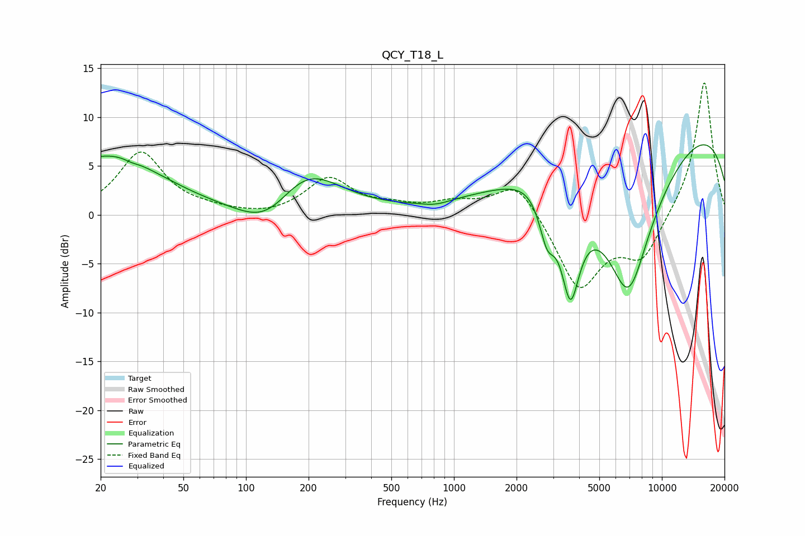

# QCY_T18_L
See [usage instructions](https://github.com/jaakkopasanen/AutoEq#usage) for more options and info.

### Parametric EQs
Apply preamp of -7.3 dB when using parametric equalizer.

|   # | Type    |   Fc (Hz) |    Q |   Gain (dB) |
|-----|---------|-----------|------|-------------|
|   1 | Peaking |        22 | 0.55 |         6.1 |
|   2 | Peaking |        28 | 4.7  |        -0.2 |
|   3 | Peaking |       128 | 1    |        -3.5 |
|   4 | Peaking |       192 | 0.84 |         5.2 |
|   5 | Peaking |       816 | 2.11 |        -0.4 |
|   6 | Peaking |      2681 | 1.18 |         1.7 |
|   7 | Peaking |      2803 | 3.5  |        -4.8 |
|   8 | Peaking |      3632 | 2.9  |       -10.4 |
|   9 | Peaking |      6903 | 0.87 |       -18.1 |
|  10 | Peaking |      9662 | 0.19 |        11.6 |

### Fixed Band EQs
When using fixed band (also called graphic) equalizer, apply preamp of **-13.6 dB** (if available) and set gains manually with these parameters.

|   # | Type    |   Fc (Hz) |    Q |   Gain (dB) |
|-----|---------|-----------|------|-------------|
|   1 | Peaking |        31 | 1.41 |         6.3 |
|   2 | Peaking |        62 | 1.41 |         0.3 |
|   3 | Peaking |       125 | 1.41 |        -0.3 |
|   4 | Peaking |       250 | 1.41 |         3.7 |
|   5 | Peaking |       500 | 1.41 |         0.7 |
|   6 | Peaking |      1000 | 1.41 |         1.1 |
|   7 | Peaking |      2000 | 1.41 |         3.6 |
|   8 | Peaking |      4000 | 1.41 |        -7.6 |
|   9 | Peaking |      8000 | 1.41 |        -4.4 |
|  10 | Peaking |     16000 | 1.41 |        13.9 |

### Graphs

