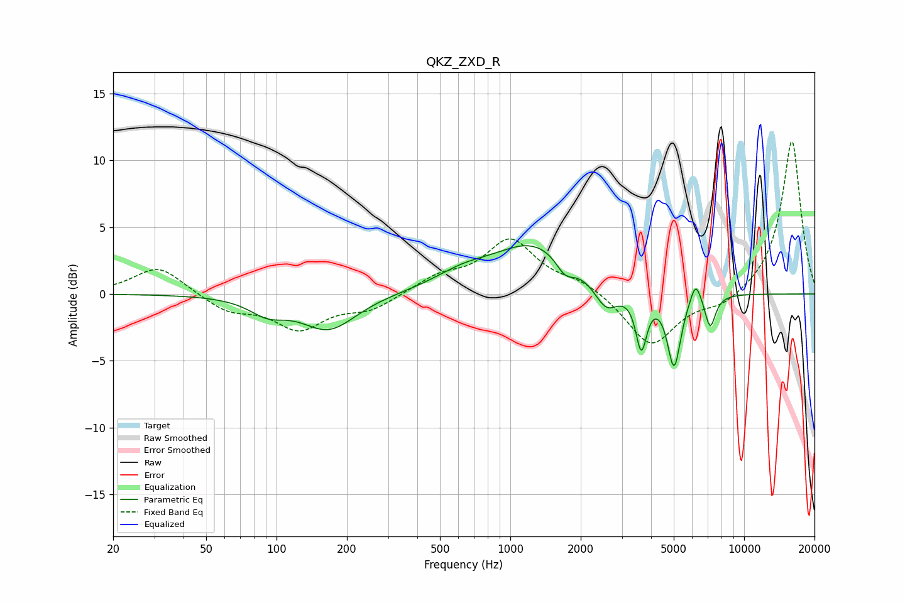

# QKZ_ZXD_R
See [usage instructions](https://github.com/jaakkopasanen/AutoEq#usage) for more options and info.

### Parametric EQs
Apply preamp of -3.7 dB when using parametric equalizer.

|   # | Type    |   Fc (Hz) |    Q |   Gain (dB) |
|-----|---------|-----------|------|-------------|
|   1 | Peaking |        91 | 1.85 |        -1.1 |
|   2 | Peaking |       167 | 1.2  |        -2.6 |
|   3 | Peaking |       624 | 1.16 |         1   |
|   4 | Peaking |      1277 | 0.79 |         3.7 |
|   5 | Peaking |      1715 | 3.51 |        -1.3 |
|   6 | Peaking |      2571 | 2.7  |        -2.1 |
|   7 | Peaking |      3633 | 6    |        -4.1 |
|   8 | Peaking |      5016 | 4.9  |        -5.5 |
|   9 | Peaking |      6208 | 5.96 |         1.7 |
|  10 | Peaking |      7159 | 6    |        -2.5 |

### Fixed Band EQs
When using fixed band (also called graphic) equalizer, apply preamp of **-11.5 dB** (if available) and set gains manually with these parameters.

|   # | Type    |   Fc (Hz) |    Q |   Gain (dB) |
|-----|---------|-----------|------|-------------|
|   1 | Peaking |        31 | 1.41 |         2.1 |
|   2 | Peaking |        62 | 1.41 |        -1.2 |
|   3 | Peaking |       125 | 1.41 |        -2.5 |
|   4 | Peaking |       250 | 1.41 |        -1.1 |
|   5 | Peaking |       500 | 1.41 |         1.2 |
|   6 | Peaking |      1000 | 1.41 |         3.9 |
|   7 | Peaking |      2000 | 1.41 |         0.9 |
|   8 | Peaking |      4000 | 1.41 |        -4   |
|   9 | Peaking |      8000 | 1.41 |        -0.9 |
|  10 | Peaking |     16000 | 1.41 |        11.6 |

### Graphs

