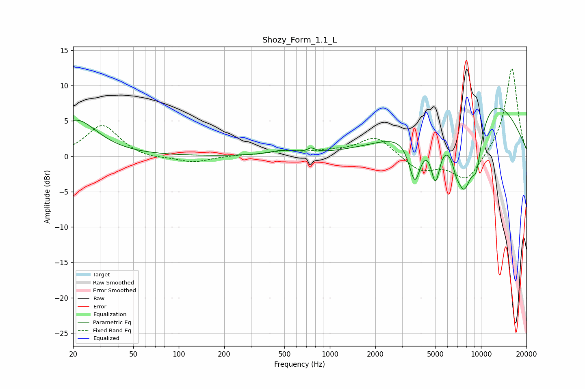

# Shozy_Form_1.1_L
See [usage instructions](https://github.com/jaakkopasanen/AutoEq#usage) for more options and info.

### Parametric EQs
Apply preamp of -6.9 dB when using parametric equalizer.

|   # | Type    |   Fc (Hz) |    Q |   Gain (dB) |
|-----|---------|-----------|------|-------------|
|   1 | Peaking |        21 | 1.02 |         5.1 |
|   2 | Peaking |       487 | 1.59 |         0.6 |
|   3 | Peaking |       754 | 5.87 |         0.6 |
|   4 | Peaking |      3652 | 3.42 |        -6.9 |
|   5 | Peaking |      5000 | 4.36 |        -6.6 |
|   6 | Peaking |      6841 | 5.93 |        -1.3 |
|   7 | Peaking |      7699 | 1.74 |       -12.9 |
|   8 | Peaking |      9119 | 0.37 |        10.9 |
|   9 | Peaking |      9206 | 3.76 |         1.5 |
|  10 | Peaking |      9306 | 3.53 |        -7   |

### Fixed Band EQs
When using fixed band (also called graphic) equalizer, apply preamp of **-12.5 dB** (if available) and set gains manually with these parameters.

|   # | Type    |   Fc (Hz) |    Q |   Gain (dB) |
|-----|---------|-----------|------|-------------|
|   1 | Peaking |        31 | 1.41 |         4.4 |
|   2 | Peaking |        62 | 1.41 |        -0.5 |
|   3 | Peaking |       125 | 1.41 |        -0.9 |
|   4 | Peaking |       250 | 1.41 |         0.1 |
|   5 | Peaking |       500 | 1.41 |         0.6 |
|   6 | Peaking |      1000 | 1.41 |         0.5 |
|   7 | Peaking |      2000 | 1.41 |         2.8 |
|   8 | Peaking |      4000 | 1.41 |        -2.1 |
|   9 | Peaking |      8000 | 1.41 |        -3.6 |
|  10 | Peaking |     16000 | 1.41 |        12.7 |

### Graphs

