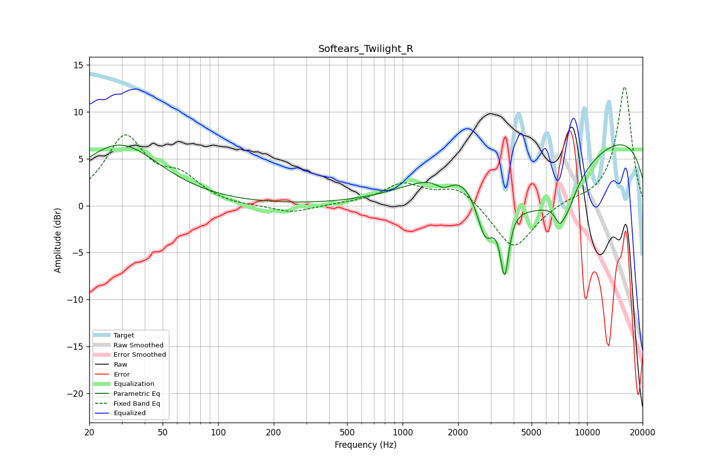

# Softears_Twilight_R
See [usage instructions](https://github.com/jaakkopasanen/AutoEq#usage) for more options and info.

### Parametric EQs
Apply preamp of -6.6 dB when using parametric equalizer.

|   # | Type    |   Fc (Hz) |    Q |   Gain (dB) |
|-----|---------|-----------|------|-------------|
|   1 | Peaking |        29 | 0.64 |         6.5 |
|   2 | Peaking |      1675 | 2.98 |        -1.3 |
|   3 | Peaking |      2115 | 0.62 |         3.5 |
|   4 | Peaking |      2452 | 5.84 |         0   |
|   5 | Peaking |      2807 | 2.85 |        -5.5 |
|   6 | Peaking |      3572 | 6    |        -7.2 |
|   7 | Peaking |      5003 | 0.53 |        -8.2 |
|   8 | Peaking |      7087 | 6    |        -1.3 |
|   9 | Peaking |      7676 | 2.28 |        -3.1 |
|  10 | Peaking |     10000 | 0.18 |         8.5 |

### Fixed Band EQs
When using fixed band (also called graphic) equalizer, apply preamp of **-12.8 dB** (if available) and set gains manually with these parameters.

|   # | Type    |   Fc (Hz) |    Q |   Gain (dB) |
|-----|---------|-----------|------|-------------|
|   1 | Peaking |        31 | 1.41 |         7.1 |
|   2 | Peaking |        62 | 1.41 |         2.5 |
|   3 | Peaking |       125 | 1.41 |        -0.1 |
|   4 | Peaking |       250 | 1.41 |        -0.8 |
|   5 | Peaking |       500 | 1.41 |         0.1 |
|   6 | Peaking |      1000 | 1.41 |         2.2 |
|   7 | Peaking |      2000 | 1.41 |         2   |
|   8 | Peaking |      4000 | 1.41 |        -4.8 |
|   9 | Peaking |      8000 | 1.41 |         0.5 |
|  10 | Peaking |     16000 | 1.41 |        12.8 |

### Graphs

