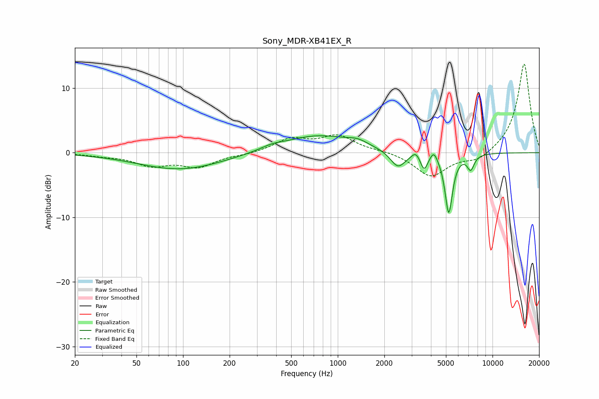

# Sony_MDR-XB41EX_R
See [usage instructions](https://github.com/jaakkopasanen/AutoEq#usage) for more options and info.

### Parametric EQs
Apply preamp of -2.7 dB when using parametric equalizer.

|   # | Type    |   Fc (Hz) |    Q |   Gain (dB) |
|-----|---------|-----------|------|-------------|
|   1 | Peaking |        96 | 0.52 |        -2.6 |
|   2 | Peaking |       374 | 1.95 |         0.5 |
|   3 | Peaking |       740 | 0.63 |         2.7 |
|   4 | Peaking |      1345 | 2.13 |         0.8 |
|   5 | Peaking |      2449 | 2.91 |        -2.6 |
|   6 | Peaking |      3189 | 6    |         0.9 |
|   7 | Peaking |      3617 | 5.99 |        -2.4 |
|   8 | Peaking |      4178 | 6    |         1.4 |
|   9 | Peaking |      5214 | 5.63 |        -9.3 |
|  10 | Peaking |      7228 | 6    |        -2.2 |

### Fixed Band EQs
When using fixed band (also called graphic) equalizer, apply preamp of **-13.8 dB** (if available) and set gains manually with these parameters.

|   # | Type    |   Fc (Hz) |    Q |   Gain (dB) |
|-----|---------|-----------|------|-------------|
|   1 | Peaking |        31 | 1.41 |        -0.4 |
|   2 | Peaking |        62 | 1.41 |        -1.8 |
|   3 | Peaking |       125 | 1.41 |        -2   |
|   4 | Peaking |       250 | 1.41 |        -0.3 |
|   5 | Peaking |       500 | 1.41 |         2   |
|   6 | Peaking |      1000 | 1.41 |         2.5 |
|   7 | Peaking |      2000 | 1.41 |         0.3 |
|   8 | Peaking |      4000 | 1.41 |        -3.7 |
|   9 | Peaking |      8000 | 1.41 |        -1.4 |
|  10 | Peaking |     16000 | 1.41 |        13.9 |

### Graphs

