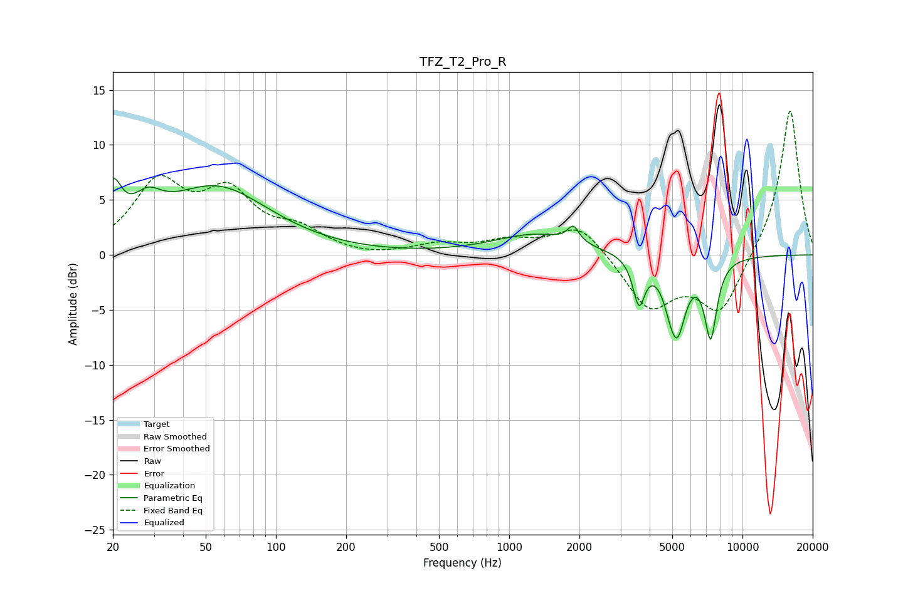

# TFZ_T2_Pro_R
See [usage instructions](https://github.com/jaakkopasanen/AutoEq#usage) for more options and info.

### Parametric EQs
Apply preamp of -7.0 dB when using parametric equalizer.

|   # | Type    |   Fc (Hz) |    Q |   Gain (dB) |
|-----|---------|-----------|------|-------------|
|   1 | Peaking |        20 | 3.83 |         4.3 |
|   2 | Peaking |        28 | 2.31 |         2.3 |
|   3 | Peaking |        55 | 0.62 |         6   |
|   4 | Peaking |      1306 | 0.8  |         1.9 |
|   5 | Peaking |      1883 | 5.94 |         1.4 |
|   6 | Peaking |      3599 | 5.65 |        -4.1 |
|   7 | Peaking |      4999 | 4.82 |        -1.5 |
|   8 | Peaking |      5122 | 5.85 |         2.1 |
|   9 | Peaking |      5204 | 3.81 |        -7.8 |
|  10 | Peaking |      7306 | 5.05 |        -6.9 |

### Fixed Band EQs
When using fixed band (also called graphic) equalizer, apply preamp of **-13.2 dB** (if available) and set gains manually with these parameters.

|   # | Type    |   Fc (Hz) |    Q |   Gain (dB) |
|-----|---------|-----------|------|-------------|
|   1 | Peaking |        31 | 1.41 |         6.2 |
|   2 | Peaking |        62 | 1.41 |         5.1 |
|   3 | Peaking |       125 | 1.41 |         1.8 |
|   4 | Peaking |       250 | 1.41 |        -0.3 |
|   5 | Peaking |       500 | 1.41 |         0.9 |
|   6 | Peaking |      1000 | 1.41 |         1.1 |
|   7 | Peaking |      2000 | 1.41 |         2.9 |
|   8 | Peaking |      4000 | 1.41 |        -4.8 |
|   9 | Peaking |      8000 | 1.41 |        -5.3 |
|  10 | Peaking |     16000 | 1.41 |        13.5 |

### Graphs

