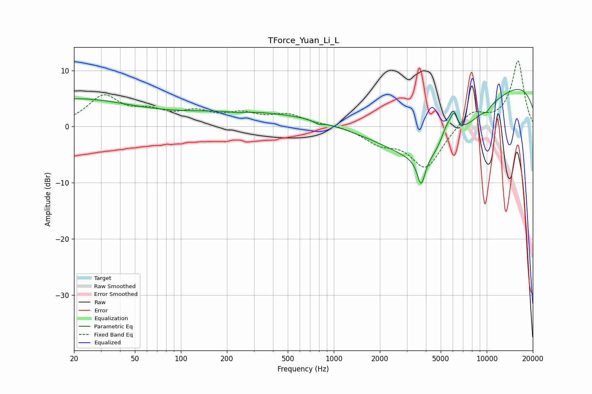

# TForce_Yuan_Li_L
See [usage instructions](https://github.com/jaakkopasanen/AutoEq#usage) for more options and info.

### Parametric EQs
Apply preamp of -6.7 dB when using parametric equalizer.

|   # | Type    |   Fc (Hz) |    Q |   Gain (dB) |
|-----|---------|-----------|------|-------------|
|   1 | Peaking |        20 | 0.37 |         4.8 |
|   2 | Peaking |       234 | 3.21 |        -0.2 |
|   3 | Peaking |       423 | 0.2  |         2.9 |
|   4 | Peaking |       793 | 5.6  |        -0.5 |
|   5 | Peaking |      3722 | 5.58 |        -4.9 |
|   6 | Peaking |      4230 | 0.4  |       -14.4 |
|   7 | Peaking |      5448 | 3.61 |         3   |
|   8 | Peaking |      6096 | 5.58 |         3.5 |
|   9 | Peaking |     10000 | 6    |        -0.6 |
|  10 | Peaking |     10000 | 0.19 |        10.4 |

### Fixed Band EQs
When using fixed band (also called graphic) equalizer, apply preamp of **-11.8 dB** (if available) and set gains manually with these parameters.

|   # | Type    |   Fc (Hz) |    Q |   Gain (dB) |
|-----|---------|-----------|------|-------------|
|   1 | Peaking |        31 | 1.41 |         5.2 |
|   2 | Peaking |        62 | 1.41 |         2.1 |
|   3 | Peaking |       125 | 1.41 |         2.2 |
|   4 | Peaking |       250 | 1.41 |         1.9 |
|   5 | Peaking |       500 | 1.41 |         1.9 |
|   6 | Peaking |      1000 | 1.41 |         0.3 |
|   7 | Peaking |      2000 | 1.41 |        -2.5 |
|   8 | Peaking |      4000 | 1.41 |        -7.4 |
|   9 | Peaking |      8000 | 1.41 |         2.9 |
|  10 | Peaking |     16000 | 1.41 |        11.7 |

### Graphs

