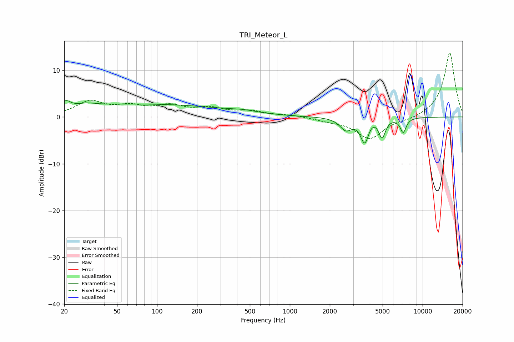

# TRI_Meteor_L
See [usage instructions](https://github.com/jaakkopasanen/AutoEq#usage) for more options and info.

### Parametric EQs
Apply preamp of -3.6 dB when using parametric equalizer.

|   # | Type    |   Fc (Hz) |    Q |   Gain (dB) |
|-----|---------|-----------|------|-------------|
|   1 | Peaking |        20 | 5.99 |        -1.9 |
|   2 | Peaking |        20 | 5.15 |         3.3 |
|   3 | Peaking |        30 | 2.27 |         0.5 |
|   4 | Peaking |        72 | 0.19 |         2.7 |
|   5 | Peaking |       448 | 1.35 |         0.5 |
|   6 | Peaking |      2642 | 3.15 |        -2.5 |
|   7 | Peaking |      3669 | 4.39 |        -5.6 |
|   8 | Peaking |      4041 | 2.91 |         1.1 |
|   9 | Peaking |      4948 | 5.53 |        -4.1 |
|  10 | Peaking |      7139 | 6    |        -3.1 |

### Fixed Band EQs
When using fixed band (also called graphic) equalizer, apply preamp of **-13.8 dB** (if available) and set gains manually with these parameters.

|   # | Type    |   Fc (Hz) |    Q |   Gain (dB) |
|-----|---------|-----------|------|-------------|
|   1 | Peaking |        31 | 1.41 |         3.1 |
|   2 | Peaking |        62 | 1.41 |         1.9 |
|   3 | Peaking |       125 | 1.41 |         2.1 |
|   4 | Peaking |       250 | 1.41 |         1.6 |
|   5 | Peaking |       500 | 1.41 |         1.1 |
|   6 | Peaking |      1000 | 1.41 |         0.4 |
|   7 | Peaking |      2000 | 1.41 |        -0.6 |
|   8 | Peaking |      4000 | 1.41 |        -4.6 |
|   9 | Peaking |      8000 | 1.41 |        -0.6 |
|  10 | Peaking |     16000 | 1.41 |        13.9 |

### Graphs

