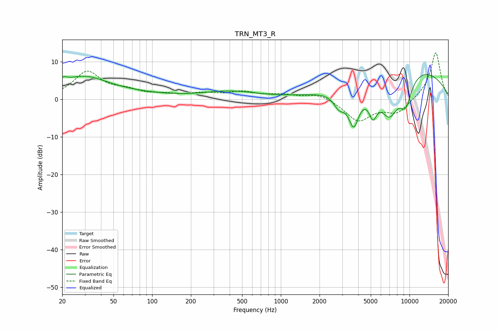

# TRN_MT3_R
See [usage instructions](https://github.com/jaakkopasanen/AutoEq#usage) for more options and info.

### Parametric EQs
Apply preamp of -6.7 dB when using parametric equalizer.

|   # | Type    |   Fc (Hz) |    Q |   Gain (dB) |
|-----|---------|-----------|------|-------------|
|   1 | Peaking |        20 | 0.2  |         2.5 |
|   2 | Peaking |        20 | 5.31 |         1   |
|   3 | Peaking |        30 | 0.86 |         3.7 |
|   4 | Peaking |       404 | 0.66 |         2   |
|   5 | Peaking |      2835 | 3.35 |        -3.5 |
|   6 | Peaking |      3687 | 3.18 |        -9.5 |
|   7 | Peaking |      5197 | 4.41 |        -5.7 |
|   8 | Peaking |      6993 | 1.61 |       -10.9 |
|   9 | Peaking |      9363 | 2.71 |        -6.9 |
|  10 | Peaking |      9691 | 0.31 |         9.4 |

### Fixed Band EQs
When using fixed band (also called graphic) equalizer, apply preamp of **-12.5 dB** (if available) and set gains manually with these parameters.

|   # | Type    |   Fc (Hz) |    Q |   Gain (dB) |
|-----|---------|-----------|------|-------------|
|   1 | Peaking |        31 | 1.41 |         7.1 |
|   2 | Peaking |        62 | 1.41 |         1.8 |
|   3 | Peaking |       125 | 1.41 |         1   |
|   4 | Peaking |       250 | 1.41 |         1.3 |
|   5 | Peaking |       500 | 1.41 |         1.8 |
|   6 | Peaking |      1000 | 1.41 |         1.1 |
|   7 | Peaking |      2000 | 1.41 |         1.6 |
|   8 | Peaking |      4000 | 1.41 |        -5.7 |
|   9 | Peaking |      8000 | 1.41 |        -3.6 |
|  10 | Peaking |     16000 | 1.41 |        12.7 |

### Graphs

