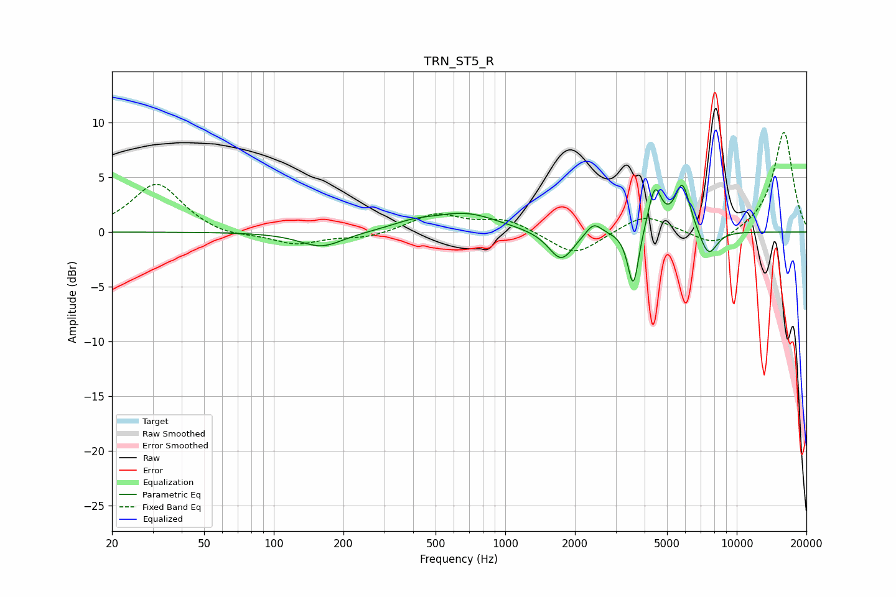

# TRN_ST5_R
See [usage instructions](https://github.com/jaakkopasanen/AutoEq#usage) for more options and info.

### Parametric EQs
Apply preamp of -4.4 dB when using parametric equalizer.

|   # | Type    |   Fc (Hz) |    Q |   Gain (dB) |
|-----|---------|-----------|------|-------------|
|   1 | Peaking |       161 | 1.5  |        -1.4 |
|   2 | Peaking |       401 | 1.47 |         0.6 |
|   3 | Peaking |       677 | 1    |         1.6 |
|   4 | Peaking |      1745 | 2.63 |        -2.8 |
|   5 | Peaking |      2408 | 4.13 |         1.2 |
|   6 | Peaking |      3574 | 5.99 |        -5.4 |
|   7 | Peaking |      4426 | 4.84 |         4   |
|   8 | Peaking |      5831 | 4.13 |         4.4 |
|   9 | Peaking |      7478 | 3.66 |        -2   |
|  10 | Peaking |      7831 | 4.07 |        -0.5 |

### Fixed Band EQs
When using fixed band (also called graphic) equalizer, apply preamp of **-9.2 dB** (if available) and set gains manually with these parameters.

|   # | Type    |   Fc (Hz) |    Q |   Gain (dB) |
|-----|---------|-----------|------|-------------|
|   1 | Peaking |        31 | 1.41 |         4.5 |
|   2 | Peaking |        62 | 1.41 |        -0.5 |
|   3 | Peaking |       125 | 1.41 |        -1.1 |
|   4 | Peaking |       250 | 1.41 |        -0.5 |
|   5 | Peaking |       500 | 1.41 |         1.6 |
|   6 | Peaking |      1000 | 1.41 |         1.1 |
|   7 | Peaking |      2000 | 1.41 |        -2.2 |
|   8 | Peaking |      4000 | 1.41 |         1.7 |
|   9 | Peaking |      8000 | 1.41 |        -1.5 |
|  10 | Peaking |     16000 | 1.41 |         9.2 |

### Graphs

