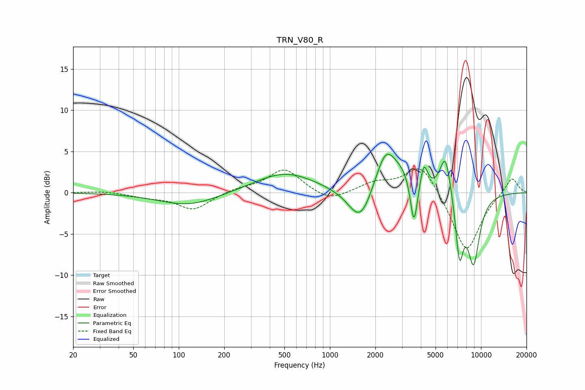

# TRN_V80_R
See [usage instructions](https://github.com/jaakkopasanen/AutoEq#usage) for more options and info.

### Parametric EQs
Apply preamp of -4.7 dB when using parametric equalizer.

|   # | Type    |   Fc (Hz) |    Q |   Gain (dB) |
|-----|---------|-----------|------|-------------|
|   1 | Peaking |       116 | 0.73 |        -1.6 |
|   2 | Peaking |       505 | 0.71 |         2.5 |
|   3 | Peaking |      1595 | 1.79 |        -4.4 |
|   4 | Peaking |      2345 | 1.97 |         5.3 |
|   5 | Peaking |      3080 | 2.23 |         1.6 |
|   6 | Peaking |      3599 | 6    |        -5.8 |
|   7 | Peaking |      4187 | 5.94 |         3.1 |
|   8 | Peaking |      5811 | 3.77 |         5.1 |
|   9 | Peaking |      7205 | 5.16 |        -7.2 |
|  10 | Peaking |      8924 | 3.09 |        -8.3 |

### Fixed Band EQs
When using fixed band (also called graphic) equalizer, apply preamp of **-3.0 dB** (if available) and set gains manually with these parameters.

|   # | Type    |   Fc (Hz) |    Q |   Gain (dB) |
|-----|---------|-----------|------|-------------|
|   1 | Peaking |        31 | 1.41 |         0.2 |
|   2 | Peaking |        62 | 1.41 |        -0.5 |
|   3 | Peaking |       125 | 1.41 |        -2.1 |
|   4 | Peaking |       250 | 1.41 |         0.5 |
|   5 | Peaking |       500 | 1.41 |         2.9 |
|   6 | Peaking |      1000 | 1.41 |        -1.2 |
|   7 | Peaking |      2000 | 1.41 |         1.1 |
|   8 | Peaking |      4000 | 1.41 |         3.7 |
|   9 | Peaking |      8000 | 1.41 |        -7.4 |
|  10 | Peaking |     16000 | 1.41 |         2   |

### Graphs

