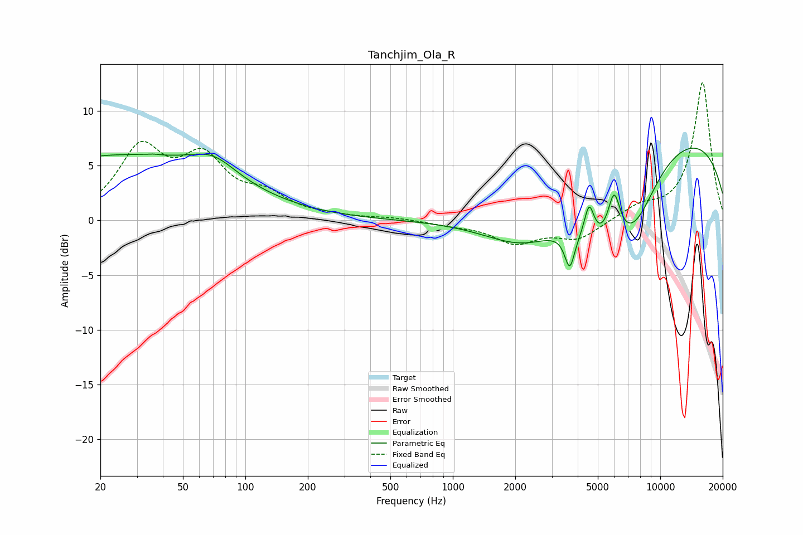

# Tanchjim_Ola_R
See [usage instructions](https://github.com/jaakkopasanen/AutoEq#usage) for more options and info.

### Parametric EQs
Apply preamp of -6.7 dB when using parametric equalizer.

|   # | Type    |   Fc (Hz) |    Q |   Gain (dB) |
|-----|---------|-----------|------|-------------|
|   1 | Peaking |        24 | 0.25 |         5.8 |
|   2 | Peaking |        36 | 5.72 |         0.1 |
|   3 | Peaking |        70 | 1.3  |         1.8 |
|   4 | Peaking |      2276 | 0.66 |        -4.9 |
|   5 | Peaking |      3659 | 6    |        -3.1 |
|   6 | Peaking |      4543 | 5.85 |         3.3 |
|   7 | Peaking |      4922 | 1    |        -4.8 |
|   8 | Peaking |      5992 | 4.7  |         4.1 |
|   9 | Peaking |      7376 | 1.08 |        -5.8 |
|  10 | Peaking |      9560 | 0.2  |         8.5 |

### Fixed Band EQs
When using fixed band (also called graphic) equalizer, apply preamp of **-12.7 dB** (if available) and set gains manually with these parameters.

|   # | Type    |   Fc (Hz) |    Q |   Gain (dB) |
|-----|---------|-----------|------|-------------|
|   1 | Peaking |        31 | 1.41 |         6.2 |
|   2 | Peaking |        62 | 1.41 |         5   |
|   3 | Peaking |       125 | 1.41 |         1.9 |
|   4 | Peaking |       250 | 1.41 |         0.3 |
|   5 | Peaking |       500 | 1.41 |         0.2 |
|   6 | Peaking |      1000 | 1.41 |        -0.3 |
|   7 | Peaking |      2000 | 1.41 |        -2   |
|   8 | Peaking |      4000 | 1.41 |        -1.7 |
|   9 | Peaking |      8000 | 1.41 |         1.1 |
|  10 | Peaking |     16000 | 1.41 |        12.6 |

### Graphs

