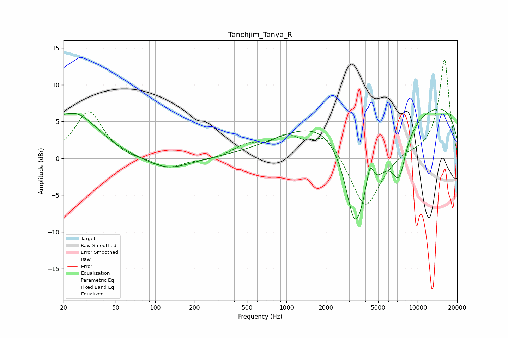

# Tanchjim_Tanya_R
See [usage instructions](https://github.com/jaakkopasanen/AutoEq#usage) for more options and info.

### Parametric EQs
Apply preamp of -6.8 dB when using parametric equalizer.

|   # | Type    |   Fc (Hz) |    Q |   Gain (dB) |
|-----|---------|-----------|------|-------------|
|   1 | Peaking |        20 | 5.02 |         1.1 |
|   2 | Peaking |        23 | 1.85 |         1.3 |
|   3 | Peaking |        27 | 0.84 |         4.8 |
|   4 | Peaking |       125 | 0.87 |        -1.6 |
|   5 | Peaking |      2675 | 0.36 |         7.9 |
|   6 | Peaking |      3309 | 1.98 |        -9.5 |
|   7 | Peaking |      4285 | 0.6  |       -14.9 |
|   8 | Peaking |      4321 | 4.64 |         4.2 |
|   9 | Peaking |      7210 | 2.6  |        -5.4 |
|  10 | Peaking |      9755 | 0.19 |         8.7 |

### Fixed Band EQs
When using fixed band (also called graphic) equalizer, apply preamp of **-13.4 dB** (if available) and set gains manually with these parameters.

|   # | Type    |   Fc (Hz) |    Q |   Gain (dB) |
|-----|---------|-----------|------|-------------|
|   1 | Peaking |        31 | 1.41 |         6.4 |
|   2 | Peaking |        62 | 1.41 |        -0.2 |
|   3 | Peaking |       125 | 1.41 |        -1.4 |
|   4 | Peaking |       250 | 1.41 |        -0.3 |
|   5 | Peaking |       500 | 1.41 |         1.6 |
|   6 | Peaking |      1000 | 1.41 |         2.7 |
|   7 | Peaking |      2000 | 1.41 |         3.2 |
|   8 | Peaking |      4000 | 1.41 |        -7.2 |
|   9 | Peaking |      8000 | 1.41 |         0.7 |
|  10 | Peaking |     16000 | 1.41 |        13.5 |

### Graphs

