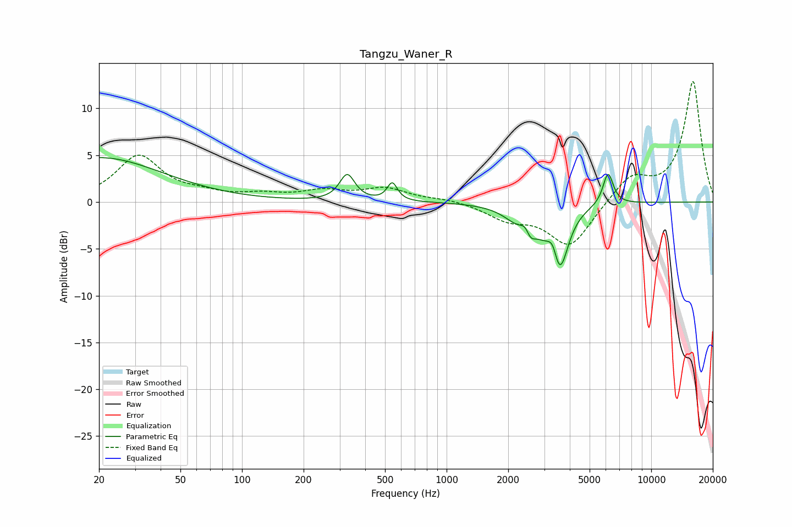

# Tangzu_Waner_R
See [usage instructions](https://github.com/jaakkopasanen/AutoEq#usage) for more options and info.

### Parametric EQs
Apply preamp of -4.8 dB when using parametric equalizer.

|   # | Type    |   Fc (Hz) |    Q |   Gain (dB) |
|-----|---------|-----------|------|-------------|
|   1 | Peaking |        20 | 0.46 |         4.7 |
|   2 | Peaking |       327 | 3.85 |         2.8 |
|   3 | Peaking |       543 | 5.85 |         1.9 |
|   4 | Peaking |      2288 | 1.96 |        -1.8 |
|   5 | Peaking |      2443 | 5.65 |         1.3 |
|   6 | Peaking |      2553 | 5.92 |        -1.6 |
|   7 | Peaking |      2898 | 2.99 |        -1.2 |
|   8 | Peaking |      3317 | 6    |         2   |
|   9 | Peaking |      3558 | 3.36 |        -7   |
|  10 | Peaking |      6154 | 5.54 |         3.5 |

### Fixed Band EQs
When using fixed band (also called graphic) equalizer, apply preamp of **-13.0 dB** (if available) and set gains manually with these parameters.

|   # | Type    |   Fc (Hz) |    Q |   Gain (dB) |
|-----|---------|-----------|------|-------------|
|   1 | Peaking |        31 | 1.41 |         4.9 |
|   2 | Peaking |        62 | 1.41 |         0.6 |
|   3 | Peaking |       125 | 1.41 |         0.6 |
|   4 | Peaking |       250 | 1.41 |         1   |
|   5 | Peaking |       500 | 1.41 |         1.4 |
|   6 | Peaking |      1000 | 1.41 |         0.3 |
|   7 | Peaking |      2000 | 1.41 |        -1.6 |
|   8 | Peaking |      4000 | 1.41 |        -4.8 |
|   9 | Peaking |      8000 | 1.41 |         2.7 |
|  10 | Peaking |     16000 | 1.41 |        12.9 |

### Graphs

