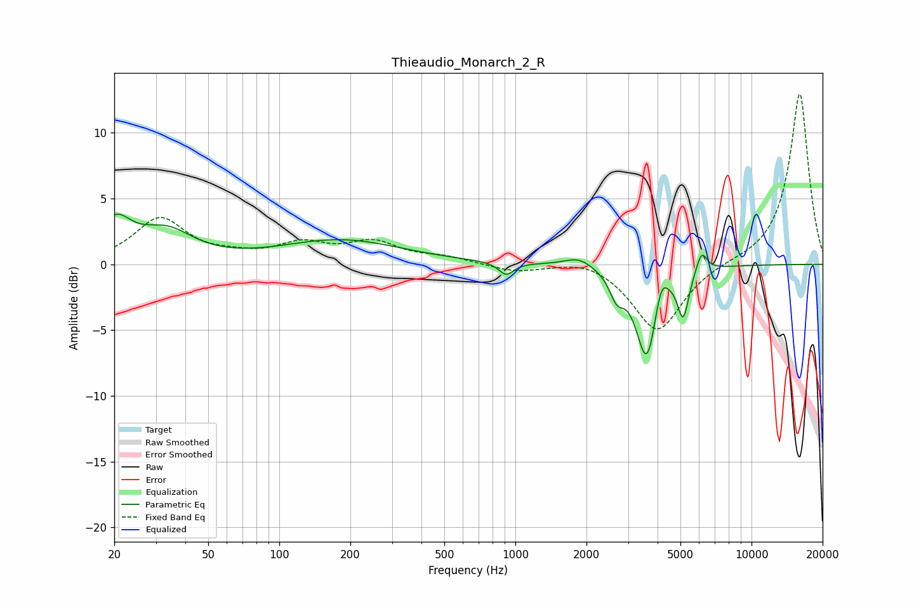

# Thieaudio_Monarch_2_R
See [usage instructions](https://github.com/jaakkopasanen/AutoEq#usage) for more options and info.

### Parametric EQs
Apply preamp of -3.9 dB when using parametric equalizer.

|   # | Type    |   Fc (Hz) |    Q |   Gain (dB) |
|-----|---------|-----------|------|-------------|
|   1 | Peaking |        20 | 2.07 |         2.9 |
|   2 | Peaking |        33 | 1.25 |         2.2 |
|   3 | Peaking |       183 | 0.55 |         1.8 |
|   4 | Peaking |       915 | 4.48 |        -1   |
|   5 | Peaking |      1859 | 2.29 |         0.7 |
|   6 | Peaking |      2689 | 4.63 |        -1.7 |
|   7 | Peaking |      3608 | 3.05 |        -7.3 |
|   8 | Peaking |      4131 | 4.88 |         2.3 |
|   9 | Peaking |      5136 | 5.96 |        -3.4 |
|  10 | Peaking |      6145 | 6    |         1.6 |

### Fixed Band EQs
When using fixed band (also called graphic) equalizer, apply preamp of **-13.0 dB** (if available) and set gains manually with these parameters.

|   # | Type    |   Fc (Hz) |    Q |   Gain (dB) |
|-----|---------|-----------|------|-------------|
|   1 | Peaking |        31 | 1.41 |         3.4 |
|   2 | Peaking |        62 | 1.41 |         0.4 |
|   3 | Peaking |       125 | 1.41 |         1.4 |
|   4 | Peaking |       250 | 1.41 |         1.5 |
|   5 | Peaking |       500 | 1.41 |         0.5 |
|   6 | Peaking |      1000 | 1.41 |        -0.6 |
|   7 | Peaking |      2000 | 1.41 |         0.6 |
|   8 | Peaking |      4000 | 1.41 |        -5.2 |
|   9 | Peaking |      8000 | 1.41 |         0.1 |
|  10 | Peaking |     16000 | 1.41 |        13.1 |

### Graphs

