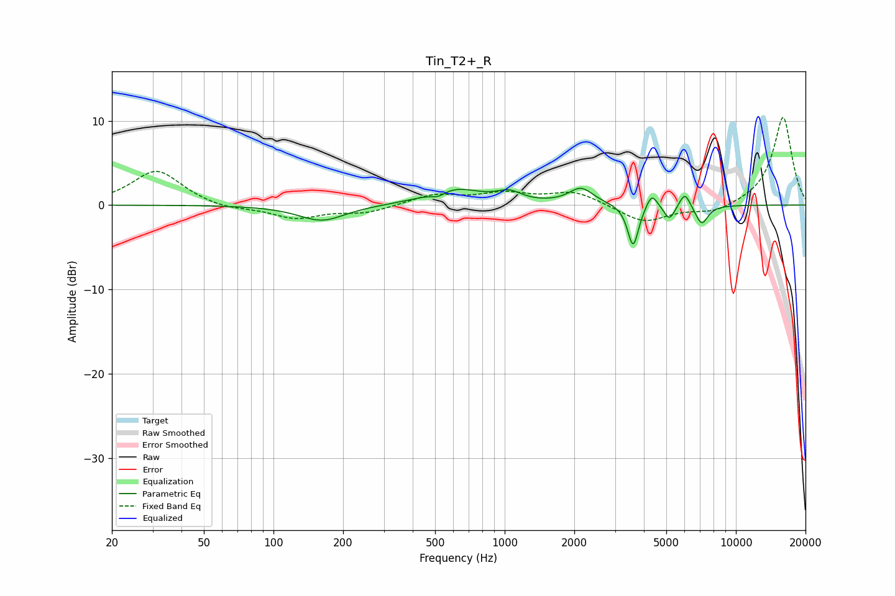

# Tin_T2+_R
See [usage instructions](https://github.com/jaakkopasanen/AutoEq#usage) for more options and info.

### Parametric EQs
Apply preamp of -2.1 dB when using parametric equalizer.

|   # | Type    |   Fc (Hz) |    Q |   Gain (dB) |
|-----|---------|-----------|------|-------------|
|   1 | Peaking |       162 | 1.4  |        -1.9 |
|   2 | Peaking |       517 | 4.36 |        -0.6 |
|   3 | Peaking |       600 | 1.22 |         2   |
|   4 | Peaking |      1045 | 2.68 |         1.1 |
|   5 | Peaking |      2140 | 2.71 |         1.9 |
|   6 | Peaking |      3594 | 5.99 |        -5.1 |
|   7 | Peaking |      4327 | 6    |         1.8 |
|   8 | Peaking |      5159 | 5.99 |        -1.8 |
|   9 | Peaking |      6015 | 6    |         1.8 |
|  10 | Peaking |      7112 | 4.94 |        -2.3 |

### Fixed Band EQs
When using fixed band (also called graphic) equalizer, apply preamp of **-10.5 dB** (if available) and set gains manually with these parameters.

|   # | Type    |   Fc (Hz) |    Q |   Gain (dB) |
|-----|---------|-----------|------|-------------|
|   1 | Peaking |        31 | 1.41 |         4.2 |
|   2 | Peaking |        62 | 1.41 |        -0.6 |
|   3 | Peaking |       125 | 1.41 |        -1.5 |
|   4 | Peaking |       250 | 1.41 |        -0.9 |
|   5 | Peaking |       500 | 1.41 |         1.2 |
|   6 | Peaking |      1000 | 1.41 |         1.2 |
|   7 | Peaking |      2000 | 1.41 |         1.6 |
|   8 | Peaking |      4000 | 1.41 |        -2.1 |
|   9 | Peaking |      8000 | 1.41 |        -1   |
|  10 | Peaking |     16000 | 1.41 |        10.5 |

### Graphs

