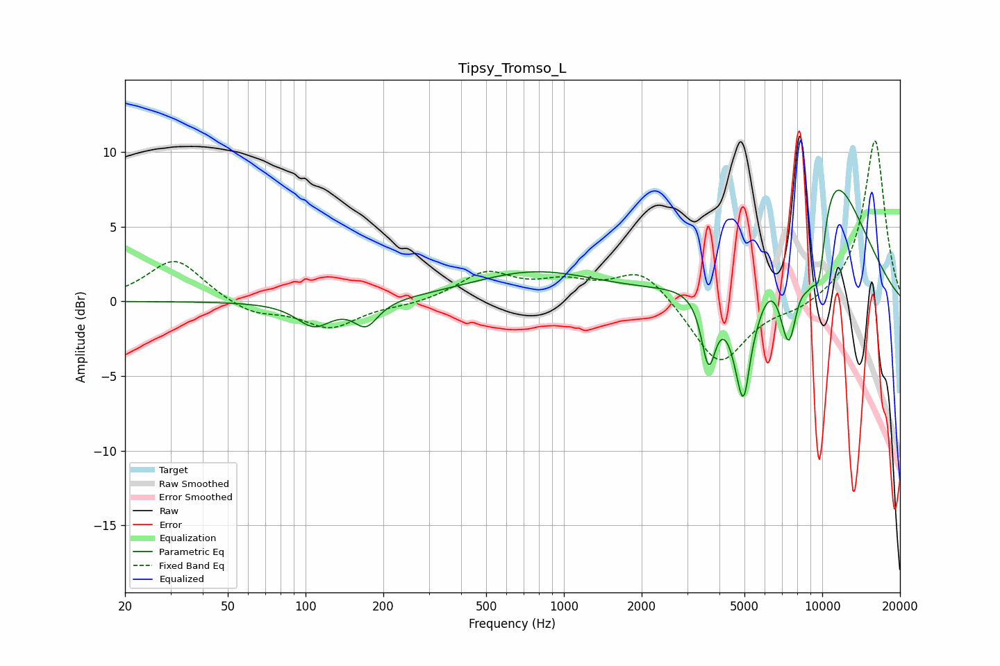

# Tipsy_Tromso_L
See [usage instructions](https://github.com/jaakkopasanen/AutoEq#usage) for more options and info.

### Parametric EQs
Apply preamp of -7.5 dB when using parametric equalizer.

|   # | Type    |   Fc (Hz) |    Q |   Gain (dB) |
|-----|---------|-----------|------|-------------|
|   1 | Peaking |       108 | 2.09 |        -1.6 |
|   2 | Peaking |       171 | 3.02 |        -1.6 |
|   3 | Peaking |       771 | 0.58 |         1.9 |
|   4 | Peaking |      3632 | 5    |        -4.7 |
|   5 | Peaking |      5004 | 3.51 |       -10.4 |
|   6 | Peaking |      5214 | 5.93 |         1.9 |
|   7 | Peaking |      7424 | 3.45 |        -7.4 |
|   8 | Peaking |      8834 | 3.09 |        -4.4 |
|   9 | Peaking |      9732 | 4.8  |        -4.8 |
|  10 | Peaking |     10000 | 0.7  |        10.4 |

### Fixed Band EQs
When using fixed band (also called graphic) equalizer, apply preamp of **-10.8 dB** (if available) and set gains manually with these parameters.

|   # | Type    |   Fc (Hz) |    Q |   Gain (dB) |
|-----|---------|-----------|------|-------------|
|   1 | Peaking |        31 | 1.41 |         2.9 |
|   2 | Peaking |        62 | 1.41 |        -0.9 |
|   3 | Peaking |       125 | 1.41 |        -1.7 |
|   4 | Peaking |       250 | 1.41 |        -0.2 |
|   5 | Peaking |       500 | 1.41 |         1.9 |
|   6 | Peaking |      1000 | 1.41 |         1.1 |
|   7 | Peaking |      2000 | 1.41 |         2.2 |
|   8 | Peaking |      4000 | 1.41 |        -4.4 |
|   9 | Peaking |      8000 | 1.41 |        -0.6 |
|  10 | Peaking |     16000 | 1.41 |        10.9 |

### Graphs

