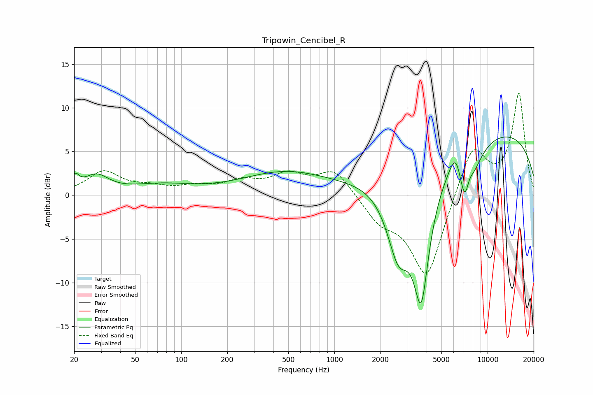

# Tripowin_Cencibel_R
See [usage instructions](https://github.com/jaakkopasanen/AutoEq#usage) for more options and info.

### Parametric EQs
Apply preamp of -6.8 dB when using parametric equalizer.

|   # | Type    |   Fc (Hz) |    Q |   Gain (dB) |
|-----|---------|-----------|------|-------------|
|   1 | Peaking |        20 | 5.81 |         1.4 |
|   2 | Peaking |        28 | 1.72 |         2   |
|   3 | Peaking |        74 | 0.71 |         1   |
|   4 | Peaking |       476 | 0.5  |         2.6 |
|   5 | Peaking |      2617 | 1.79 |        -8.2 |
|   6 | Peaking |      3689 | 2.4  |       -14.4 |
|   7 | Peaking |      6271 | 2.94 |         4.5 |
|   8 | Peaking |      7235 | 2.42 |       -10.8 |
|   9 | Peaking |      7531 | 4.32 |         3.9 |
|  10 | Peaking |     10000 | 0.21 |         7.6 |

### Fixed Band EQs
When using fixed band (also called graphic) equalizer, apply preamp of **-11.8 dB** (if available) and set gains manually with these parameters.

|   # | Type    |   Fc (Hz) |    Q |   Gain (dB) |
|-----|---------|-----------|------|-------------|
|   1 | Peaking |        31 | 1.41 |         2.6 |
|   2 | Peaking |        62 | 1.41 |         0.7 |
|   3 | Peaking |       125 | 1.41 |         0.8 |
|   4 | Peaking |       250 | 1.41 |         1.4 |
|   5 | Peaking |       500 | 1.41 |         2.1 |
|   6 | Peaking |      1000 | 1.41 |         2.9 |
|   7 | Peaking |      2000 | 1.41 |        -2.5 |
|   8 | Peaking |      4000 | 1.41 |        -9.6 |
|   9 | Peaking |      8000 | 1.41 |         5.9 |
|  10 | Peaking |     16000 | 1.41 |        11.6 |

### Graphs

