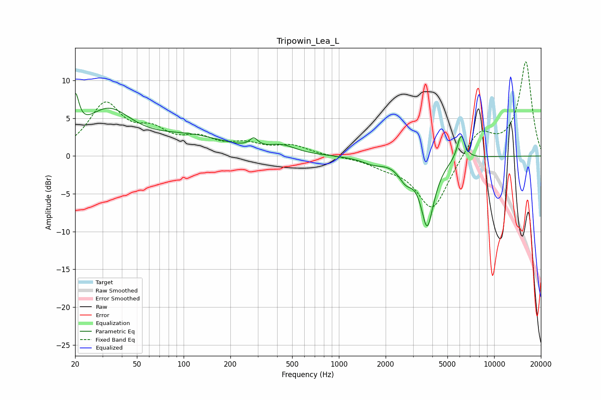

# Tripowin_Lea_L
See [usage instructions](https://github.com/jaakkopasanen/AutoEq#usage) for more options and info.

### Parametric EQs
Apply preamp of -8.4 dB when using parametric equalizer.

|   # | Type    |   Fc (Hz) |    Q |   Gain (dB) |
|-----|---------|-----------|------|-------------|
|   1 | Peaking |        20 | 6    |         5   |
|   2 | Peaking |        33 | 0.9  |         5.7 |
|   3 | Peaking |       112 | 0.6  |         2.2 |
|   4 | Peaking |       283 | 5.43 |         1.1 |
|   5 | Peaking |       430 | 1.61 |         1.1 |
|   6 | Peaking |      1676 | 1.86 |        -0.8 |
|   7 | Peaking |      2693 | 3    |        -2.1 |
|   8 | Peaking |      3729 | 3.42 |        -9.7 |
|   9 | Peaking |      3830 | 6    |         1   |
|  10 | Peaking |      6121 | 5.56 |         3.4 |

### Fixed Band EQs
When using fixed band (also called graphic) equalizer, apply preamp of **-12.6 dB** (if available) and set gains manually with these parameters.

|   # | Type    |   Fc (Hz) |    Q |   Gain (dB) |
|-----|---------|-----------|------|-------------|
|   1 | Peaking |        31 | 1.41 |         6.6 |
|   2 | Peaking |        62 | 1.41 |         2.6 |
|   3 | Peaking |       125 | 1.41 |         1.9 |
|   4 | Peaking |       250 | 1.41 |         1.3 |
|   5 | Peaking |       500 | 1.41 |         1.3 |
|   6 | Peaking |      1000 | 1.41 |        -0   |
|   7 | Peaking |      2000 | 1.41 |        -1   |
|   8 | Peaking |      4000 | 1.41 |        -7.2 |
|   9 | Peaking |      8000 | 1.41 |         3.4 |
|  10 | Peaking |     16000 | 1.41 |        12.5 |

### Graphs

