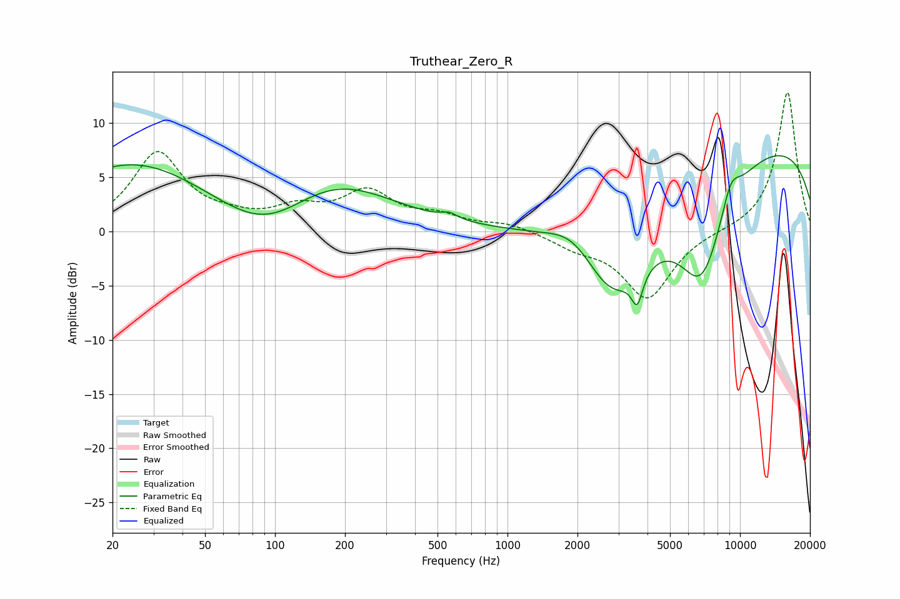

# Truthear_Zero_R
See [usage instructions](https://github.com/jaakkopasanen/AutoEq#usage) for more options and info.

### Parametric EQs
Apply preamp of -7.1 dB when using parametric equalizer.

|   # | Type    |   Fc (Hz) |    Q |   Gain (dB) |
|-----|---------|-----------|------|-------------|
|   1 | Peaking |        25 | 0.44 |         6.3 |
|   2 | Peaking |        92 | 0.73 |        -3.4 |
|   3 | Peaking |       176 | 0.55 |         4.8 |
|   4 | Peaking |       563 | 4.11 |         0.5 |
|   5 | Peaking |      1936 | 1.29 |         2.5 |
|   6 | Peaking |      2839 | 0.81 |       -10.6 |
|   7 | Peaking |      3614 | 5.92 |        -2.8 |
|   8 | Peaking |      6845 | 1.22 |       -10.1 |
|   9 | Peaking |      9120 | 3.21 |         2.4 |
|  10 | Peaking |      9824 | 0.18 |         8.8 |

### Fixed Band EQs
When using fixed band (also called graphic) equalizer, apply preamp of **-12.9 dB** (if available) and set gains manually with these parameters.

|   # | Type    |   Fc (Hz) |    Q |   Gain (dB) |
|-----|---------|-----------|------|-------------|
|   1 | Peaking |        31 | 1.41 |         7.2 |
|   2 | Peaking |        62 | 1.41 |         0.8 |
|   3 | Peaking |       125 | 1.41 |         1.8 |
|   4 | Peaking |       250 | 1.41 |         3.4 |
|   5 | Peaking |       500 | 1.41 |         1.2 |
|   6 | Peaking |      1000 | 1.41 |         0.7 |
|   7 | Peaking |      2000 | 1.41 |        -1.2 |
|   8 | Peaking |      4000 | 1.41 |        -6.1 |
|   9 | Peaking |      8000 | 1.41 |         0   |
|  10 | Peaking |     16000 | 1.41 |        13   |

### Graphs

