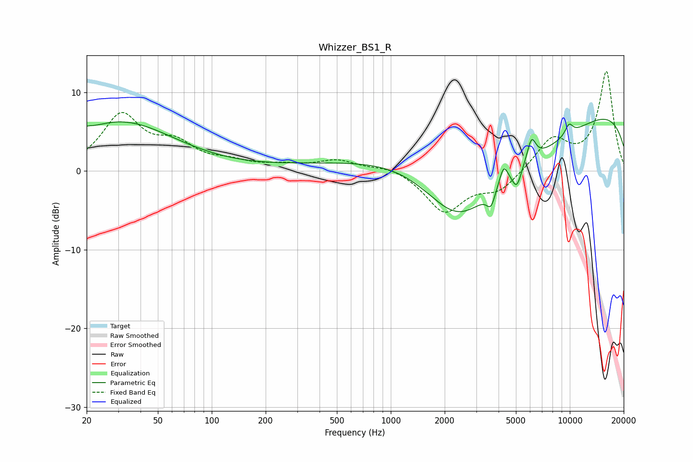

# Whizzer_BS1_R
See [usage instructions](https://github.com/jaakkopasanen/AutoEq#usage) for more options and info.

### Parametric EQs
Apply preamp of -6.7 dB when using parametric equalizer.

|   # | Type    |   Fc (Hz) |    Q |   Gain (dB) |
|-----|---------|-----------|------|-------------|
|   1 | Peaking |        20 | 5.63 |         0.4 |
|   2 | Peaking |        31 | 0.47 |         6.2 |
|   3 | Peaking |      1359 | 0.32 |        11.4 |
|   4 | Peaking |      2364 | 0.35 |       -20   |
|   5 | Peaking |      3629 | 6    |        -2   |
|   6 | Peaking |      4271 | 5.98 |         2.4 |
|   7 | Peaking |      5058 | 5.52 |        -2.4 |
|   8 | Peaking |      6108 | 5.52 |         3   |
|   9 | Peaking |      9897 | 5.52 |         1.4 |
|  10 | Peaking |     10000 | 0.18 |         9.3 |

### Fixed Band EQs
When using fixed band (also called graphic) equalizer, apply preamp of **-12.7 dB** (if available) and set gains manually with these parameters.

|   # | Type    |   Fc (Hz) |    Q |   Gain (dB) |
|-----|---------|-----------|------|-------------|
|   1 | Peaking |        31 | 1.41 |         6.8 |
|   2 | Peaking |        62 | 1.41 |         2.9 |
|   3 | Peaking |       125 | 1.41 |         0.9 |
|   4 | Peaking |       250 | 1.41 |         0.6 |
|   5 | Peaking |       500 | 1.41 |         1.3 |
|   6 | Peaking |      1000 | 1.41 |         0.7 |
|   7 | Peaking |      2000 | 1.41 |        -5.2 |
|   8 | Peaking |      4000 | 1.41 |        -2.4 |
|   9 | Peaking |      8000 | 1.41 |         4   |
|  10 | Peaking |     16000 | 1.41 |        12.6 |

### Graphs

