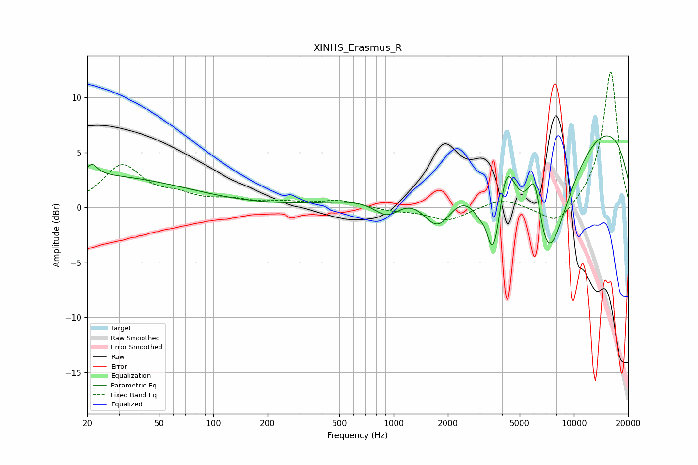

# XINHS_Erasmus_R
See [usage instructions](https://github.com/jaakkopasanen/AutoEq#usage) for more options and info.

### Parametric EQs
Apply preamp of -6.6 dB when using parametric equalizer.

|   # | Type    |   Fc (Hz) |    Q |   Gain (dB) |
|-----|---------|-----------|------|-------------|
|   1 | Peaking |        20 | 0.25 |         2.9 |
|   2 | Peaking |        21 | 4.7  |         1   |
|   3 | Peaking |       923 | 1.76 |        -2.1 |
|   4 | Peaking |      1761 | 1.52 |        -4.9 |
|   5 | Peaking |      3239 | 5.91 |         1.1 |
|   6 | Peaking |      3583 | 2.08 |       -11.2 |
|   7 | Peaking |      4156 | 2.7  |         6.9 |
|   8 | Peaking |      6062 | 3.5  |         5.5 |
|   9 | Peaking |      7041 | 0.89 |       -15.6 |
|  10 | Peaking |      8117 | 0.18 |        11.1 |

### Fixed Band EQs
When using fixed band (also called graphic) equalizer, apply preamp of **-12.4 dB** (if available) and set gains manually with these parameters.

|   # | Type    |   Fc (Hz) |    Q |   Gain (dB) |
|-----|---------|-----------|------|-------------|
|   1 | Peaking |        31 | 1.41 |         3.7 |
|   2 | Peaking |        62 | 1.41 |         0.9 |
|   3 | Peaking |       125 | 1.41 |         0.6 |
|   4 | Peaking |       250 | 1.41 |         0.4 |
|   5 | Peaking |       500 | 1.41 |         0.6 |
|   6 | Peaking |      1000 | 1.41 |        -0.3 |
|   7 | Peaking |      2000 | 1.41 |        -1.2 |
|   8 | Peaking |      4000 | 1.41 |         0.9 |
|   9 | Peaking |      8000 | 1.41 |        -1.9 |
|  10 | Peaking |     16000 | 1.41 |        12.5 |

### Graphs

