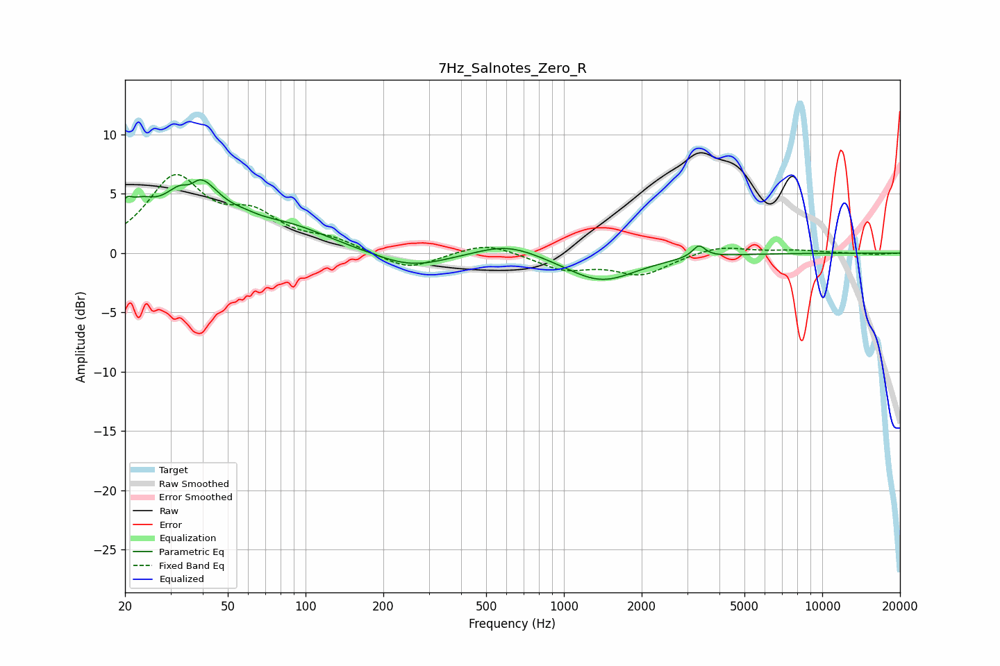

# 7Hz_Salnotes_Zero_R
See [usage instructions](https://github.com/jaakkopasanen/AutoEq#usage) for more options and info.

### Parametric EQs
Apply preamp of -6.3 dB when using parametric equalizer.

|   # | Type    |   Fc (Hz) |    Q |   Gain (dB) |
|-----|---------|-----------|------|-------------|
|   1 | Peaking |        20 | 5.83 |         1.7 |
|   2 | Peaking |        23 | 2.52 |         2.1 |
|   3 | Peaking |        36 | 4.41 |        -1.4 |
|   4 | Peaking |        37 | 1.56 |         6.3 |
|   5 | Peaking |        58 | 2.7  |         0.3 |
|   6 | Peaking |        84 | 0.81 |         2   |
|   7 | Peaking |       256 | 1    |        -1.4 |
|   8 | Peaking |       605 | 1.17 |         1.1 |
|   9 | Peaking |      1396 | 1.04 |        -2.4 |
|  10 | Peaking |      3331 | 5.77 |         1   |

### Fixed Band EQs
When using fixed band (also called graphic) equalizer, apply preamp of **-6.7 dB** (if available) and set gains manually with these parameters.

|   # | Type    |   Fc (Hz) |    Q |   Gain (dB) |
|-----|---------|-----------|------|-------------|
|   1 | Peaking |        31 | 1.41 |         6.1 |
|   2 | Peaking |        62 | 1.41 |         2.7 |
|   3 | Peaking |       125 | 1.41 |         1   |
|   4 | Peaking |       250 | 1.41 |        -1.5 |
|   5 | Peaking |       500 | 1.41 |         1   |
|   6 | Peaking |      1000 | 1.41 |        -1.3 |
|   7 | Peaking |      2000 | 1.41 |        -1.7 |
|   8 | Peaking |      4000 | 1.41 |         0.7 |
|   9 | Peaking |      8000 | 1.41 |         0.2 |
|  10 | Peaking |     16000 | 1.41 |        -0.1 |

### Graphs

