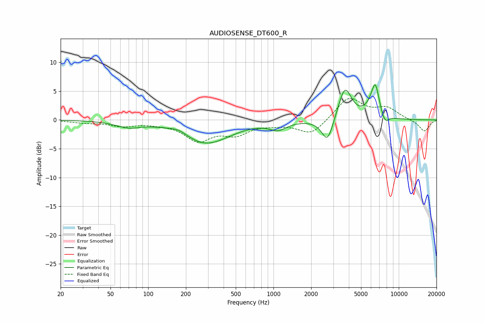

# AUDIOSENSE_DT600_R
See [usage instructions](https://github.com/jaakkopasanen/AutoEq#usage) for more options and info.

### Parametric EQs
Apply preamp of -6.2 dB when using parametric equalizer.

|   # | Type    |   Fc (Hz) |    Q |   Gain (dB) |
|-----|---------|-----------|------|-------------|
|   1 | Peaking |        69 | 1.44 |        -1   |
|   2 | Peaking |       175 | 2.07 |         0.8 |
|   3 | Peaking |       285 | 0.78 |        -4   |
|   4 | Peaking |       442 | 1.01 |        -0.2 |
|   5 | Peaking |      1085 | 2.12 |        -1.4 |
|   6 | Peaking |      2700 | 3.05 |        -4.3 |
|   7 | Peaking |      3712 | 2.63 |         5.8 |
|   8 | Peaking |      6245 | 2.68 |         2.4 |
|   9 | Peaking |      6515 | 4.95 |         3.8 |
|  10 | Peaking |      7757 | 4.48 |        -1.6 |

### Fixed Band EQs
When using fixed band (also called graphic) equalizer, apply preamp of **-3.9 dB** (if available) and set gains manually with these parameters.

|   # | Type    |   Fc (Hz) |    Q |   Gain (dB) |
|-----|---------|-----------|------|-------------|
|   1 | Peaking |        31 | 1.41 |        -0.4 |
|   2 | Peaking |        62 | 1.41 |        -0.9 |
|   3 | Peaking |       125 | 1.41 |        -0.4 |
|   4 | Peaking |       250 | 1.41 |        -3.3 |
|   5 | Peaking |       500 | 1.41 |        -2.2 |
|   6 | Peaking |      1000 | 1.41 |        -0.5 |
|   7 | Peaking |      2000 | 1.41 |        -2.6 |
|   8 | Peaking |      4000 | 1.41 |         4   |
|   9 | Peaking |      8000 | 1.41 |         1.9 |
|  10 | Peaking |     16000 | 1.41 |        -2   |

### Graphs

