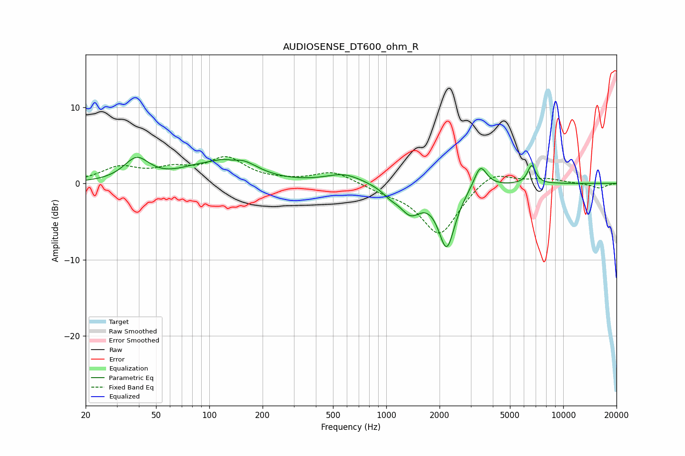

# AUDIOSENSE_DT600_ohm_R
See [usage instructions](https://github.com/jaakkopasanen/AutoEq#usage) for more options and info.

### Parametric EQs
Apply preamp of -3.5 dB when using parametric equalizer.

|   # | Type    |   Fc (Hz) |    Q |   Gain (dB) |
|-----|---------|-----------|------|-------------|
|   1 | Peaking |        39 | 2    |         3   |
|   2 | Peaking |        84 | 1.18 |         1.2 |
|   3 | Peaking |       137 | 3.04 |        -0.9 |
|   4 | Peaking |       140 | 1.33 |         3.3 |
|   5 | Peaking |       578 | 1.39 |         1.3 |
|   6 | Peaking |      1054 | 3    |        -0.9 |
|   7 | Peaking |      1370 | 2.31 |        -3.3 |
|   8 | Peaking |      2196 | 2.96 |        -8   |
|   9 | Peaking |      3402 | 3.98 |         3   |
|  10 | Peaking |      6633 | 6    |         2.4 |

### Fixed Band EQs
When using fixed band (also called graphic) equalizer, apply preamp of **-3.6 dB** (if available) and set gains manually with these parameters.

|   # | Type    |   Fc (Hz) |    Q |   Gain (dB) |
|-----|---------|-----------|------|-------------|
|   1 | Peaking |        31 | 1.41 |         1.9 |
|   2 | Peaking |        62 | 1.41 |         1.5 |
|   3 | Peaking |       125 | 1.41 |         3.1 |
|   4 | Peaking |       250 | 1.41 |         0.2 |
|   5 | Peaking |       500 | 1.41 |         1.6 |
|   6 | Peaking |      1000 | 1.41 |        -0.7 |
|   7 | Peaking |      2000 | 1.41 |        -6.8 |
|   8 | Peaking |      4000 | 1.41 |         1.9 |
|   9 | Peaking |      8000 | 1.41 |         0.6 |
|  10 | Peaking |     16000 | 1.41 |        -0.6 |

### Graphs

