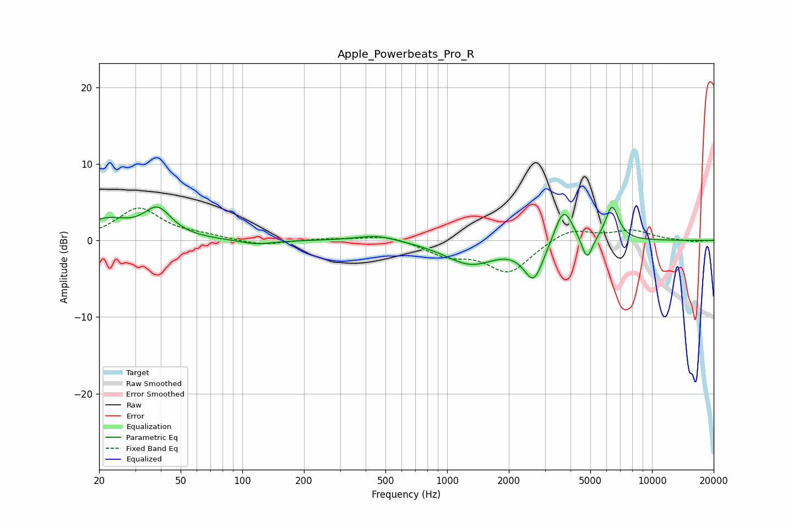

# Apple_Powerbeats_Pro_R
See [usage instructions](https://github.com/jaakkopasanen/AutoEq#usage) for more options and info.

### Parametric EQs
Apply preamp of -4.5 dB when using parametric equalizer.

|   # | Type    |   Fc (Hz) |    Q |   Gain (dB) |
|-----|---------|-----------|------|-------------|
|   1 | Peaking |        22 | 1.29 |         2.5 |
|   2 | Peaking |        39 | 2.11 |         3.7 |
|   3 | Peaking |       117 | 1.7  |        -0.6 |
|   4 | Peaking |       453 | 1.42 |         0.8 |
|   5 | Peaking |      1302 | 1.14 |        -3   |
|   6 | Peaking |      2652 | 2.91 |        -5.4 |
|   7 | Peaking |      2685 | 3.32 |         0.4 |
|   8 | Peaking |      3704 | 3.06 |         4.9 |
|   9 | Peaking |      4817 | 5.32 |        -3.3 |
|  10 | Peaking |      6385 | 4.26 |         4.5 |

### Fixed Band EQs
When using fixed band (also called graphic) equalizer, apply preamp of **-4.3 dB** (if available) and set gains manually with these parameters.

|   # | Type    |   Fc (Hz) |    Q |   Gain (dB) |
|-----|---------|-----------|------|-------------|
|   1 | Peaking |        31 | 1.41 |         4.2 |
|   2 | Peaking |        62 | 1.41 |         0.5 |
|   3 | Peaking |       125 | 1.41 |        -0.7 |
|   4 | Peaking |       250 | 1.41 |         0.2 |
|   5 | Peaking |       500 | 1.41 |         0.8 |
|   6 | Peaking |      1000 | 1.41 |        -1.7 |
|   7 | Peaking |      2000 | 1.41 |        -4.1 |
|   8 | Peaking |      4000 | 1.41 |         1.7 |
|   9 | Peaking |      8000 | 1.41 |         1.3 |
|  10 | Peaking |     16000 | 1.41 |        -0.2 |

### Graphs

