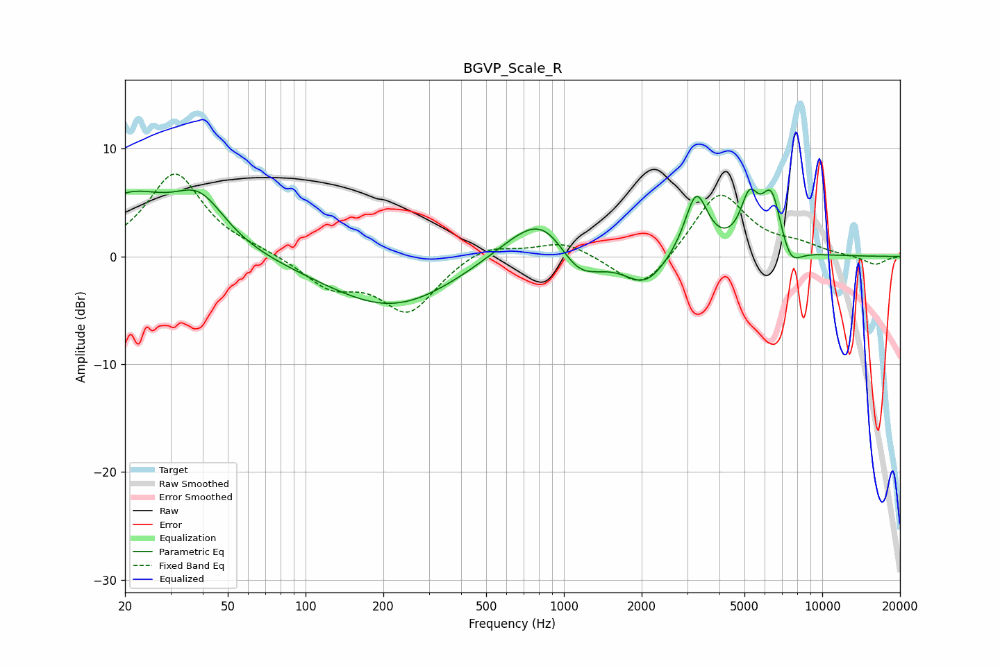

# BGVP_Scale_R
See [usage instructions](https://github.com/jaakkopasanen/AutoEq#usage) for more options and info.

### Parametric EQs
Apply preamp of -6.4 dB when using parametric equalizer.

|   # | Type    |   Fc (Hz) |    Q |   Gain (dB) |
|-----|---------|-----------|------|-------------|
|   1 | Peaking |        21 | 0.88 |         5.2 |
|   2 | Peaking |        39 | 1.41 |         4.3 |
|   3 | Peaking |       218 | 0.55 |        -4.9 |
|   4 | Peaking |       877 | 0.95 |         7.1 |
|   5 | Peaking |      1112 | 1.34 |        -5.6 |
|   6 | Peaking |      2064 | 1.72 |        -2.9 |
|   7 | Peaking |      3253 | 3.17 |         5.8 |
|   8 | Peaking |      5224 | 3.98 |         4.3 |
|   9 | Peaking |      6371 | 3.35 |         5.7 |
|  10 | Peaking |      7493 | 3.22 |        -2.2 |

### Fixed Band EQs
When using fixed band (also called graphic) equalizer, apply preamp of **-7.7 dB** (if available) and set gains manually with these parameters.

|   # | Type    |   Fc (Hz) |    Q |   Gain (dB) |
|-----|---------|-----------|------|-------------|
|   1 | Peaking |        31 | 1.41 |         7.7 |
|   2 | Peaking |        62 | 1.41 |         0.4 |
|   3 | Peaking |       125 | 1.41 |        -2.6 |
|   4 | Peaking |       250 | 1.41 |        -5   |
|   5 | Peaking |       500 | 1.41 |         1.3 |
|   6 | Peaking |      1000 | 1.41 |         1.4 |
|   7 | Peaking |      2000 | 1.41 |        -3.5 |
|   8 | Peaking |      4000 | 1.41 |         6.1 |
|   9 | Peaking |      8000 | 1.41 |         0.8 |
|  10 | Peaking |     16000 | 1.41 |        -0.8 |

### Graphs

