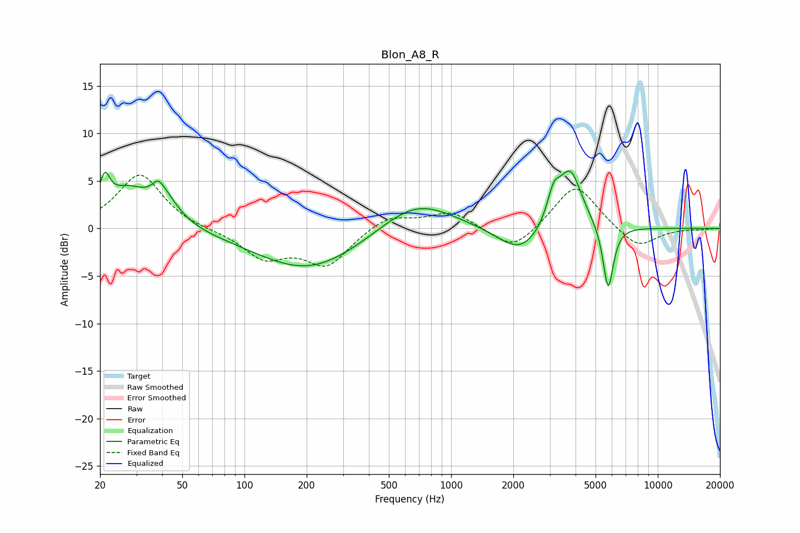

# Blon_A8_R
See [usage instructions](https://github.com/jaakkopasanen/AutoEq#usage) for more options and info.

### Parametric EQs
Apply preamp of -6.1 dB when using parametric equalizer.

|   # | Type    |   Fc (Hz) |    Q |   Gain (dB) |
|-----|---------|-----------|------|-------------|
|   1 | Peaking |        21 | 5.63 |         3.3 |
|   2 | Peaking |        27 | 1.38 |         3.7 |
|   3 | Peaking |        38 | 5.65 |         1   |
|   4 | Peaking |        41 | 2.04 |         2.7 |
|   5 | Peaking |       204 | 0.55 |        -4.5 |
|   6 | Peaking |       676 | 0.81 |         3.4 |
|   7 | Peaking |      2165 | 1.31 |        -2.9 |
|   8 | Peaking |      3132 | 4.42 |         2.9 |
|   9 | Peaking |      3771 | 2.44 |         6.2 |
|  10 | Peaking |      5755 | 5.52 |        -7   |

### Fixed Band EQs
When using fixed band (also called graphic) equalizer, apply preamp of **-5.7 dB** (if available) and set gains manually with these parameters.

|   # | Type    |   Fc (Hz) |    Q |   Gain (dB) |
|-----|---------|-----------|------|-------------|
|   1 | Peaking |        31 | 1.41 |         5.8 |
|   2 | Peaking |        62 | 1.41 |        -0.2 |
|   3 | Peaking |       125 | 1.41 |        -2.9 |
|   4 | Peaking |       250 | 1.41 |        -3.8 |
|   5 | Peaking |       500 | 1.41 |         1.5 |
|   6 | Peaking |      1000 | 1.41 |         1.8 |
|   7 | Peaking |      2000 | 1.41 |        -2.5 |
|   8 | Peaking |      4000 | 1.41 |         4.8 |
|   9 | Peaking |      8000 | 1.41 |        -2.2 |
|  10 | Peaking |     16000 | 1.41 |        -0.1 |

### Graphs

