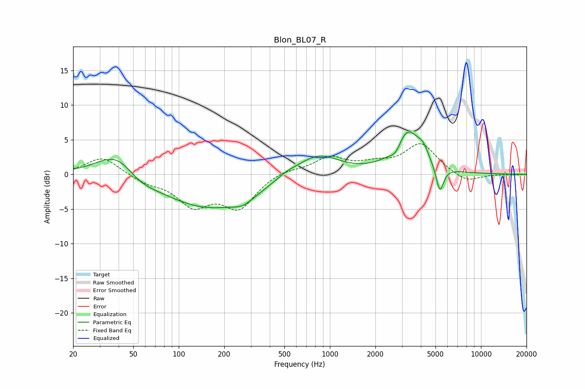

# Blon_BL07_R
See [usage instructions](https://github.com/jaakkopasanen/AutoEq#usage) for more options and info.

### Parametric EQs
Apply preamp of -6.2 dB when using parametric equalizer.

|   # | Type    |   Fc (Hz) |    Q |   Gain (dB) |
|-----|---------|-----------|------|-------------|
|   1 | Peaking |        40 | 1.02 |         4.3 |
|   2 | Peaking |        53 | 1.3  |        -1.7 |
|   3 | Peaking |       160 | 0.44 |        -5   |
|   4 | Peaking |       266 | 2.24 |        -1   |
|   5 | Peaking |       514 | 1.93 |         0.7 |
|   6 | Peaking |       826 | 1.02 |         3.2 |
|   7 | Peaking |      2728 | 3.98 |        -1.4 |
|   8 | Peaking |      3266 | 1.67 |         6.2 |
|   9 | Peaking |      4137 | 4.16 |         1.4 |
|  10 | Peaking |      5343 | 5.51 |        -3.9 |

### Fixed Band EQs
When using fixed band (also called graphic) equalizer, apply preamp of **-4.5 dB** (if available) and set gains manually with these parameters.

|   # | Type    |   Fc (Hz) |    Q |   Gain (dB) |
|-----|---------|-----------|------|-------------|
|   1 | Peaking |        31 | 1.41 |         2.6 |
|   2 | Peaking |        62 | 1.41 |        -1   |
|   3 | Peaking |       125 | 1.41 |        -4.1 |
|   4 | Peaking |       250 | 1.41 |        -4.6 |
|   5 | Peaking |       500 | 1.41 |         0.7 |
|   6 | Peaking |      1000 | 1.41 |         2.3 |
|   7 | Peaking |      2000 | 1.41 |         1.2 |
|   8 | Peaking |      4000 | 1.41 |         4.3 |
|   9 | Peaking |      8000 | 1.41 |        -1.3 |
|  10 | Peaking |     16000 | 1.41 |        -0.1 |

### Graphs

