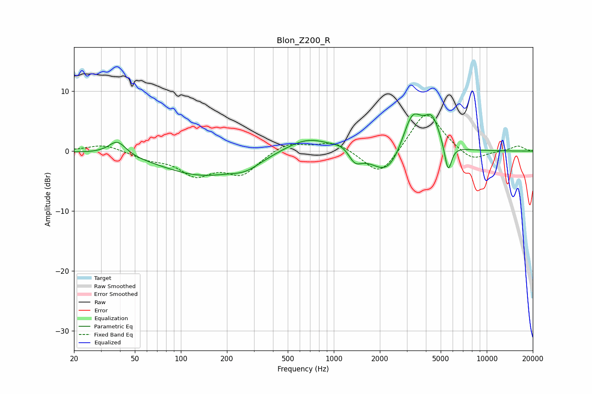

# Blon_Z200_R
See [usage instructions](https://github.com/jaakkopasanen/AutoEq#usage) for more options and info.

### Parametric EQs
Apply preamp of -6.3 dB when using parametric equalizer.

|   # | Type    |   Fc (Hz) |    Q |   Gain (dB) |
|-----|---------|-----------|------|-------------|
|   1 | Peaking |        38 | 2.48 |         2.4 |
|   2 | Peaking |       139 | 0.52 |        -4   |
|   3 | Peaking |       266 | 1.55 |        -1.3 |
|   4 | Peaking |       676 | 0.93 |         2.6 |
|   5 | Peaking |      1159 | 2.33 |         1   |
|   6 | Peaking |      1371 | 3.17 |        -2.2 |
|   7 | Peaking |      2258 | 1.36 |        -4.8 |
|   8 | Peaking |      3256 | 2.09 |         7   |
|   9 | Peaking |      4388 | 2.68 |         4.7 |
|  10 | Peaking |      5587 | 5.99 |        -4.9 |

### Fixed Band EQs
When using fixed band (also called graphic) equalizer, apply preamp of **-6.1 dB** (if available) and set gains manually with these parameters.

|   # | Type    |   Fc (Hz) |    Q |   Gain (dB) |
|-----|---------|-----------|------|-------------|
|   1 | Peaking |        31 | 1.41 |         1.2 |
|   2 | Peaking |        62 | 1.41 |        -1.1 |
|   3 | Peaking |       125 | 1.41 |        -3.6 |
|   4 | Peaking |       250 | 1.41 |        -3.6 |
|   5 | Peaking |       500 | 1.41 |         1.6 |
|   6 | Peaking |      1000 | 1.41 |         1.7 |
|   7 | Peaking |      2000 | 1.41 |        -4.5 |
|   8 | Peaking |      4000 | 1.41 |         7   |
|   9 | Peaking |      8000 | 1.41 |        -1.9 |
|  10 | Peaking |     16000 | 1.41 |         0.9 |

### Graphs

