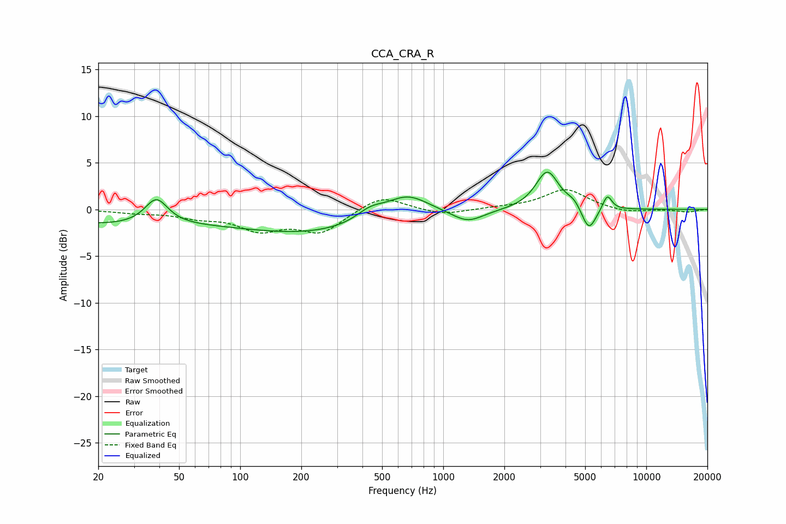

# CCA_CRA_R
See [usage instructions](https://github.com/jaakkopasanen/AutoEq#usage) for more options and info.

### Parametric EQs
Apply preamp of -4.1 dB when using parametric equalizer.

|   # | Type    |   Fc (Hz) |    Q |   Gain (dB) |
|-----|---------|-----------|------|-------------|
|   1 | Peaking |        39 | 2.55 |         2.8 |
|   2 | Peaking |        58 | 0.34 |         2.5 |
|   3 | Peaking |        76 | 0.18 |        -4.4 |
|   4 | Peaking |       437 | 2.03 |         1.2 |
|   5 | Peaking |       664 | 1.33 |         2.3 |
|   6 | Peaking |      1320 | 1.8  |        -1.4 |
|   7 | Peaking |      3254 | 2.49 |         4.1 |
|   8 | Peaking |      4409 | 4.08 |         0.7 |
|   9 | Peaking |      5213 | 3.9  |        -2.7 |
|  10 | Peaking |      6426 | 6    |         1.6 |

### Fixed Band EQs
When using fixed band (also called graphic) equalizer, apply preamp of **-2.2 dB** (if available) and set gains manually with these parameters.

|   # | Type    |   Fc (Hz) |    Q |   Gain (dB) |
|-----|---------|-----------|------|-------------|
|   1 | Peaking |        31 | 1.41 |        -0.3 |
|   2 | Peaking |        62 | 1.41 |        -0.7 |
|   3 | Peaking |       125 | 1.41 |        -2   |
|   4 | Peaking |       250 | 1.41 |        -2.4 |
|   5 | Peaking |       500 | 1.41 |         1.6 |
|   6 | Peaking |      1000 | 1.41 |        -0.6 |
|   7 | Peaking |      2000 | 1.41 |         0.2 |
|   8 | Peaking |      4000 | 1.41 |         2.2 |
|   9 | Peaking |      8000 | 1.41 |        -0.4 |
|  10 | Peaking |     16000 | 1.41 |        -0.3 |

### Graphs

