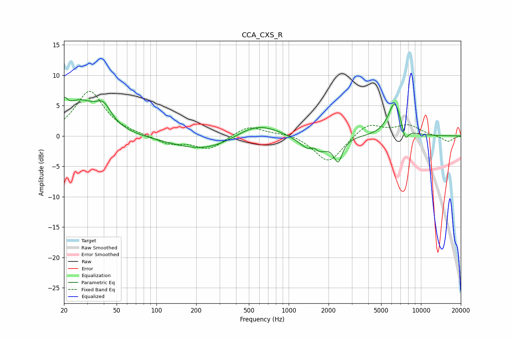

# CCA_CXS_R
See [usage instructions](https://github.com/jaakkopasanen/AutoEq#usage) for more options and info.

### Parametric EQs
Apply preamp of -6.5 dB when using parametric equalizer.

|   # | Type    |   Fc (Hz) |    Q |   Gain (dB) |
|-----|---------|-----------|------|-------------|
|   1 | Peaking |        20 | 6    |         2.2 |
|   2 | Peaking |        26 | 1.07 |         5.3 |
|   3 | Peaking |        40 | 2.38 |         3   |
|   4 | Peaking |       236 | 0.57 |        -2.6 |
|   5 | Peaking |       568 | 0.84 |         2.6 |
|   6 | Peaking |      1546 | 3.93 |         2.2 |
|   7 | Peaking |      1559 | 1.95 |        -4.4 |
|   8 | Peaking |      2363 | 4.44 |        -3.5 |
|   9 | Peaking |      6334 | 2.76 |         5.6 |
|  10 | Peaking |      7592 | 5.42 |        -2.4 |

### Fixed Band EQs
When using fixed band (also called graphic) equalizer, apply preamp of **-7.4 dB** (if available) and set gains manually with these parameters.

|   # | Type    |   Fc (Hz) |    Q |   Gain (dB) |
|-----|---------|-----------|------|-------------|
|   1 | Peaking |        31 | 1.41 |         7.4 |
|   2 | Peaking |        62 | 1.41 |         0.1 |
|   3 | Peaking |       125 | 1.41 |        -1.3 |
|   4 | Peaking |       250 | 1.41 |        -2.2 |
|   5 | Peaking |       500 | 1.41 |         1.8 |
|   6 | Peaking |      1000 | 1.41 |         0.5 |
|   7 | Peaking |      2000 | 1.41 |        -4.5 |
|   8 | Peaking |      4000 | 1.41 |         2.2 |
|   9 | Peaking |      8000 | 1.41 |         1.7 |
|  10 | Peaking |     16000 | 1.41 |        -1   |

### Graphs

