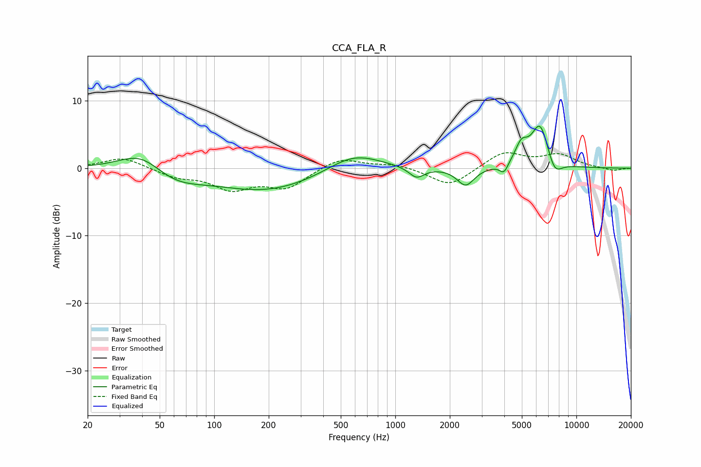

# CCA_FLA_R
See [usage instructions](https://github.com/jaakkopasanen/AutoEq#usage) for more options and info.

### Parametric EQs
Apply preamp of -6.3 dB when using parametric equalizer.

|   # | Type    |   Fc (Hz) |    Q |   Gain (dB) |
|-----|---------|-----------|------|-------------|
|   1 | Peaking |        39 | 1.17 |         3   |
|   2 | Peaking |        60 | 1    |        -2   |
|   3 | Peaking |       196 | 0.49 |        -3.4 |
|   4 | Peaking |       589 | 0.95 |         2.8 |
|   5 | Peaking |      1310 | 3.34 |        -1.6 |
|   6 | Peaking |      2446 | 2.99 |        -2.7 |
|   7 | Peaking |      3984 | 6    |        -1.5 |
|   8 | Peaking |      4968 | 3.95 |         2.7 |
|   9 | Peaking |      6308 | 2.75 |         6.6 |
|  10 | Peaking |      7552 | 3.26 |        -2.6 |

### Fixed Band EQs
When using fixed band (also called graphic) equalizer, apply preamp of **-2.4 dB** (if available) and set gains manually with these parameters.

|   # | Type    |   Fc (Hz) |    Q |   Gain (dB) |
|-----|---------|-----------|------|-------------|
|   1 | Peaking |        31 | 1.41 |         1.7 |
|   2 | Peaking |        62 | 1.41 |        -1.2 |
|   3 | Peaking |       125 | 1.41 |        -2.8 |
|   4 | Peaking |       250 | 1.41 |        -2.8 |
|   5 | Peaking |       500 | 1.41 |         1.7 |
|   6 | Peaking |      1000 | 1.41 |         0.6 |
|   7 | Peaking |      2000 | 1.41 |        -2.7 |
|   8 | Peaking |      4000 | 1.41 |         2.4 |
|   9 | Peaking |      8000 | 1.41 |         1.9 |
|  10 | Peaking |     16000 | 1.41 |        -0.4 |

### Graphs

