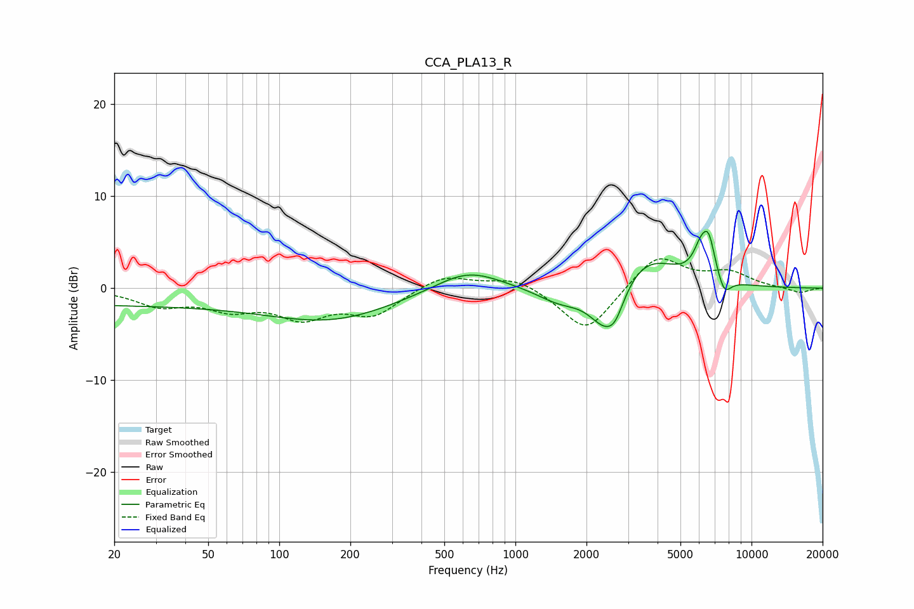

# CCA_PLA13_R
See [usage instructions](https://github.com/jaakkopasanen/AutoEq#usage) for more options and info.

### Parametric EQs
Apply preamp of -6.3 dB when using parametric equalizer.

|   # | Type    |   Fc (Hz) |    Q |   Gain (dB) |
|-----|---------|-----------|------|-------------|
|   1 | Peaking |        21 | 0.18 |        -1.8 |
|   2 | Peaking |       172 | 0.54 |        -3   |
|   3 | Peaking |       628 | 1.02 |         2.3 |
|   4 | Peaking |      1547 | 1.4  |        -1.7 |
|   5 | Peaking |      2378 | 2    |        -4.3 |
|   6 | Peaking |      2646 | 3.58 |        -2.2 |
|   7 | Peaking |      3558 | 1.07 |         3.7 |
|   8 | Peaking |      6098 | 4.26 |         2.7 |
|   9 | Peaking |      6594 | 4.97 |         3.8 |
|  10 | Peaking |      7670 | 4.77 |        -1.9 |

### Fixed Band EQs
When using fixed band (also called graphic) equalizer, apply preamp of **-3.3 dB** (if available) and set gains manually with these parameters.

|   # | Type    |   Fc (Hz) |    Q |   Gain (dB) |
|-----|---------|-----------|------|-------------|
|   1 | Peaking |        31 | 1.41 |        -1.7 |
|   2 | Peaking |        62 | 1.41 |        -1.9 |
|   3 | Peaking |       125 | 1.41 |        -2.8 |
|   4 | Peaking |       250 | 1.41 |        -2.7 |
|   5 | Peaking |       500 | 1.41 |         1.5 |
|   6 | Peaking |      1000 | 1.41 |         1.3 |
|   7 | Peaking |      2000 | 1.41 |        -4.9 |
|   8 | Peaking |      4000 | 1.41 |         3.7 |
|   9 | Peaking |      8000 | 1.41 |         1.6 |
|  10 | Peaking |     16000 | 1.41 |        -0.6 |

### Graphs

