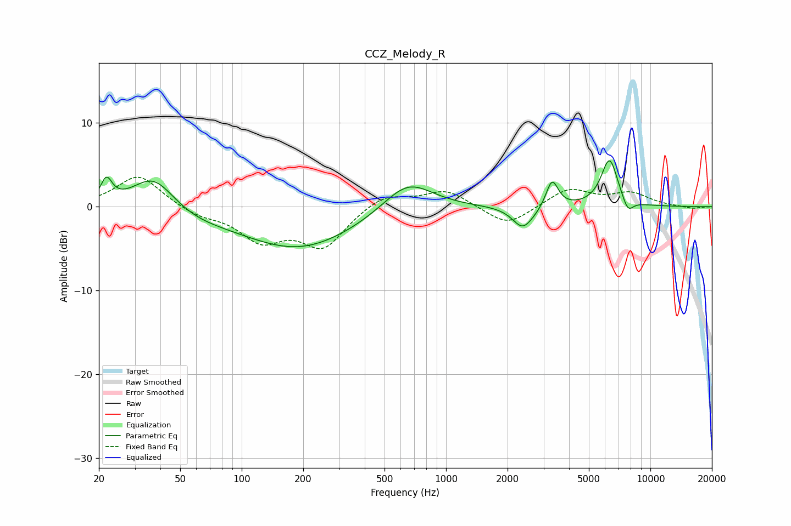

# CCZ_Melody_R
See [usage instructions](https://github.com/jaakkopasanen/AutoEq#usage) for more options and info.

### Parametric EQs
Apply preamp of -5.6 dB when using parametric equalizer.

|   # | Type    |   Fc (Hz) |    Q |   Gain (dB) |
|-----|---------|-----------|------|-------------|
|   1 | Peaking |        22 | 5.24 |         2.7 |
|   2 | Peaking |        37 | 1.36 |         4.2 |
|   3 | Peaking |        57 | 0.91 |        -0.9 |
|   4 | Peaking |       190 | 0.5  |        -5   |
|   5 | Peaking |       649 | 1.14 |         3.8 |
|   6 | Peaking |      2367 | 2.96 |        -2.3 |
|   7 | Peaking |      2670 | 1.81 |        -0.6 |
|   8 | Peaking |      3302 | 4.63 |         3.5 |
|   9 | Peaking |      6311 | 3.31 |         5.7 |
|  10 | Peaking |      7757 | 4.87 |        -1.7 |

### Fixed Band EQs
When using fixed band (also called graphic) equalizer, apply preamp of **-3.6 dB** (if available) and set gains manually with these parameters.

|   # | Type    |   Fc (Hz) |    Q |   Gain (dB) |
|-----|---------|-----------|------|-------------|
|   1 | Peaking |        31 | 1.41 |         3.8 |
|   2 | Peaking |        62 | 1.41 |        -1   |
|   3 | Peaking |       125 | 1.41 |        -3.7 |
|   4 | Peaking |       250 | 1.41 |        -4.6 |
|   5 | Peaking |       500 | 1.41 |         1.6 |
|   6 | Peaking |      1000 | 1.41 |         2   |
|   7 | Peaking |      2000 | 1.41 |        -2.4 |
|   8 | Peaking |      4000 | 1.41 |         2.2 |
|   9 | Peaking |      8000 | 1.41 |         1.5 |
|  10 | Peaking |     16000 | 1.41 |        -0.3 |

### Graphs

