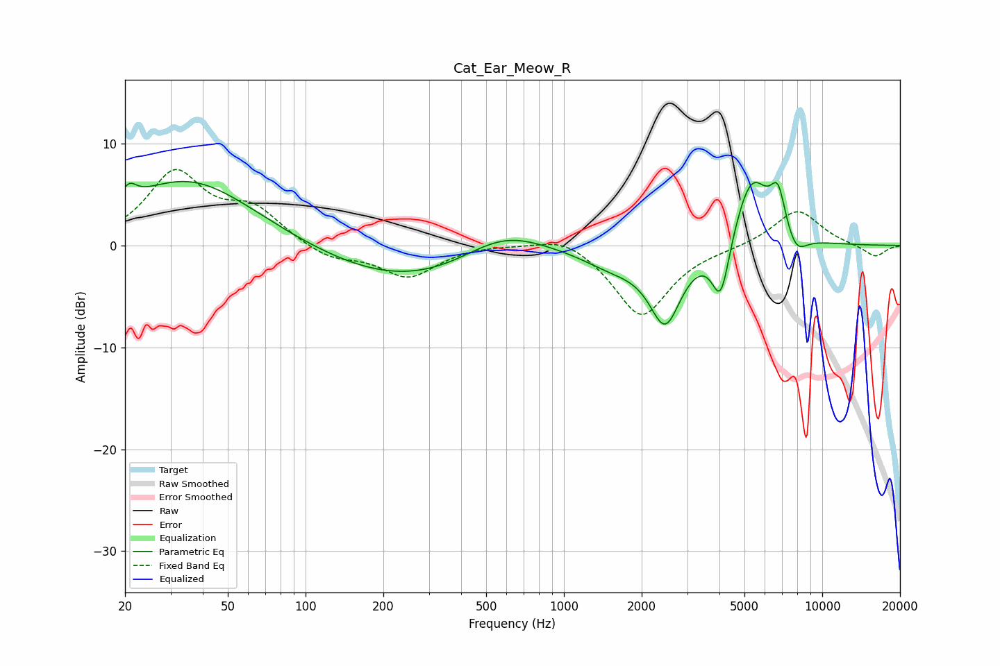

# Cat_Ear_Meow_R
See [usage instructions](https://github.com/jaakkopasanen/AutoEq#usage) for more options and info.

### Parametric EQs
Apply preamp of -6.4 dB when using parametric equalizer.

|   # | Type    |   Fc (Hz) |    Q |   Gain (dB) |
|-----|---------|-----------|------|-------------|
|   1 | Peaking |        21 | 5.15 |         1.4 |
|   2 | Peaking |        35 | 0.54 |         6.6 |
|   3 | Peaking |       258 | 0.42 |        -3.8 |
|   4 | Peaking |       581 | 0.85 |         3   |
|   5 | Peaking |      1554 | 1.15 |        -1.7 |
|   6 | Peaking |      2469 | 2.25 |        -7.2 |
|   7 | Peaking |      4049 | 3.93 |        -6.1 |
|   8 | Peaking |      5323 | 1.94 |         7.2 |
|   9 | Peaking |      6744 | 4.64 |         4   |
|  10 | Peaking |      7905 | 3.17 |        -2.1 |

### Fixed Band EQs
When using fixed band (also called graphic) equalizer, apply preamp of **-7.6 dB** (if available) and set gains manually with these parameters.

|   # | Type    |   Fc (Hz) |    Q |   Gain (dB) |
|-----|---------|-----------|------|-------------|
|   1 | Peaking |        31 | 1.41 |         6.9 |
|   2 | Peaking |        62 | 1.41 |         3.2 |
|   3 | Peaking |       125 | 1.41 |        -1.4 |
|   4 | Peaking |       250 | 1.41 |        -3   |
|   5 | Peaking |       500 | 1.41 |         0.2 |
|   6 | Peaking |      1000 | 1.41 |         1.3 |
|   7 | Peaking |      2000 | 1.41 |        -7   |
|   8 | Peaking |      4000 | 1.41 |        -0.1 |
|   9 | Peaking |      8000 | 1.41 |         3.6 |
|  10 | Peaking |     16000 | 1.41 |        -1.2 |

### Graphs

