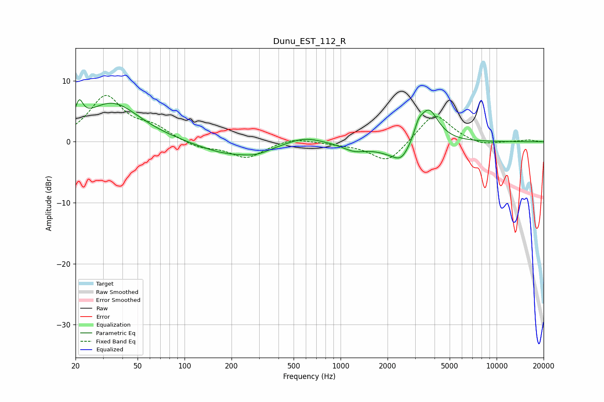

# Dunu_EST_112_R
See [usage instructions](https://github.com/jaakkopasanen/AutoEq#usage) for more options and info.

### Parametric EQs
Apply preamp of -7.0 dB when using parametric equalizer.

|   # | Type    |   Fc (Hz) |    Q |   Gain (dB) |
|-----|---------|-----------|------|-------------|
|   1 | Peaking |        21 | 5.98 |         3.1 |
|   2 | Peaking |        34 | 0.8  |         6.4 |
|   3 | Peaking |       189 | 0.74 |        -2   |
|   4 | Peaking |       291 | 1.58 |        -0.9 |
|   5 | Peaking |       589 | 1.33 |         1.1 |
|   6 | Peaking |      1221 | 1.96 |        -1.1 |
|   7 | Peaking |      2351 | 1.11 |        -2.4 |
|   8 | Peaking |      2458 | 2.89 |        -1.6 |
|   9 | Peaking |      3148 | 5.53 |         1.6 |
|  10 | Peaking |      3651 | 2.17 |         6.2 |

### Fixed Band EQs
When using fixed band (also called graphic) equalizer, apply preamp of **-7.7 dB** (if available) and set gains manually with these parameters.

|   # | Type    |   Fc (Hz) |    Q |   Gain (dB) |
|-----|---------|-----------|------|-------------|
|   1 | Peaking |        31 | 1.41 |         7.3 |
|   2 | Peaking |        62 | 1.41 |         2   |
|   3 | Peaking |       125 | 1.41 |        -1   |
|   4 | Peaking |       250 | 1.41 |        -2.6 |
|   5 | Peaking |       500 | 1.41 |         0.8 |
|   6 | Peaking |      1000 | 1.41 |        -0.3 |
|   7 | Peaking |      2000 | 1.41 |        -3.5 |
|   8 | Peaking |      4000 | 1.41 |         4.9 |
|   9 | Peaking |      8000 | 1.41 |        -0.7 |
|  10 | Peaking |     16000 | 1.41 |         0.3 |

### Graphs

