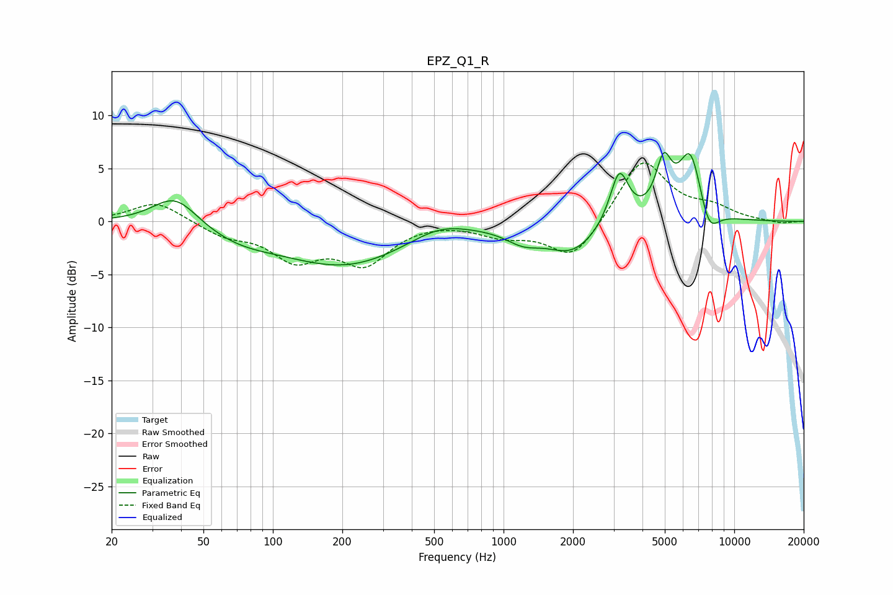

# EPZ_Q1_R
See [usage instructions](https://github.com/jaakkopasanen/AutoEq#usage) for more options and info.

### Parametric EQs
Apply preamp of -6.6 dB when using parametric equalizer.

|   # | Type    |   Fc (Hz) |    Q |   Gain (dB) |
|-----|---------|-----------|------|-------------|
|   1 | Peaking |        38 | 1.44 |         3   |
|   2 | Peaking |        70 | 0.84 |        -1.3 |
|   3 | Peaking |       207 | 0.52 |        -4   |
|   4 | Peaking |       524 | 1.14 |         1.2 |
|   5 | Peaking |      1216 | 1.83 |        -1.3 |
|   6 | Peaking |      1986 | 1.27 |        -2.8 |
|   7 | Peaking |      3173 | 3.46 |         5.1 |
|   8 | Peaking |      4941 | 4.06 |         4.7 |
|   9 | Peaking |      6465 | 2.57 |         6.7 |
|  10 | Peaking |      7739 | 3.09 |        -2.9 |

### Fixed Band EQs
When using fixed band (also called graphic) equalizer, apply preamp of **-5.6 dB** (if available) and set gains manually with these parameters.

|   # | Type    |   Fc (Hz) |    Q |   Gain (dB) |
|-----|---------|-----------|------|-------------|
|   1 | Peaking |        31 | 1.41 |         1.9 |
|   2 | Peaking |        62 | 1.41 |        -1.2 |
|   3 | Peaking |       125 | 1.41 |        -3.3 |
|   4 | Peaking |       250 | 1.41 |        -3.7 |
|   5 | Peaking |       500 | 1.41 |         0.1 |
|   6 | Peaking |      1000 | 1.41 |        -1.2 |
|   7 | Peaking |      2000 | 1.41 |        -3.7 |
|   8 | Peaking |      4000 | 1.41 |         6   |
|   9 | Peaking |      8000 | 1.41 |         1.1 |
|  10 | Peaking |     16000 | 1.41 |        -0.2 |

### Graphs

