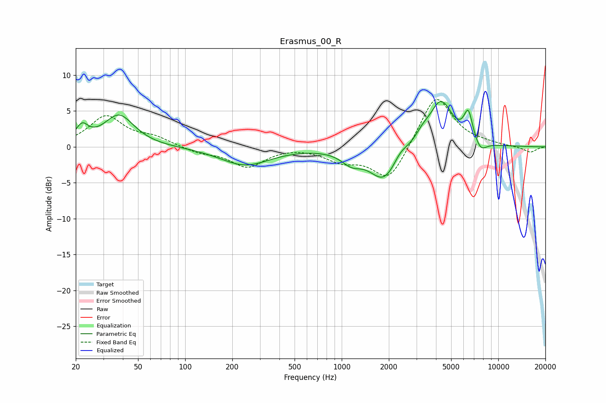

# Erasmus_00_R
See [usage instructions](https://github.com/jaakkopasanen/AutoEq#usage) for more options and info.

### Parametric EQs
Apply preamp of -6.4 dB when using parametric equalizer.

|   # | Type    |   Fc (Hz) |    Q |   Gain (dB) |
|-----|---------|-----------|------|-------------|
|   1 | Peaking |        22 | 3.58 |         2.2 |
|   2 | Peaking |        38 | 1.48 |         4.4 |
|   3 | Peaking |       241 | 0.89 |        -2.5 |
|   4 | Peaking |      1153 | 2.22 |        -1.6 |
|   5 | Peaking |      1865 | 1.54 |        -4.7 |
|   6 | Peaking |      2365 | 3.09 |         1.1 |
|   7 | Peaking |      3281 | 3.11 |         1   |
|   8 | Peaking |      4304 | 1.84 |         6.4 |
|   9 | Peaking |      6437 | 4.83 |         4   |
|  10 | Peaking |      7704 | 3.41 |        -1.5 |

### Fixed Band EQs
When using fixed band (also called graphic) equalizer, apply preamp of **-6.7 dB** (if available) and set gains manually with these parameters.

|   # | Type    |   Fc (Hz) |    Q |   Gain (dB) |
|-----|---------|-----------|------|-------------|
|   1 | Peaking |        31 | 1.41 |         4.2 |
|   2 | Peaking |        62 | 1.41 |         1.2 |
|   3 | Peaking |       125 | 1.41 |        -0.8 |
|   4 | Peaking |       250 | 1.41 |        -2.7 |
|   5 | Peaking |       500 | 1.41 |         0.1 |
|   6 | Peaking |      1000 | 1.41 |        -1.7 |
|   7 | Peaking |      2000 | 1.41 |        -4.9 |
|   8 | Peaking |      4000 | 1.41 |         7.5 |
|   9 | Peaking |      8000 | 1.41 |         0.3 |
|  10 | Peaking |     16000 | 1.41 |        -0.8 |

### Graphs

