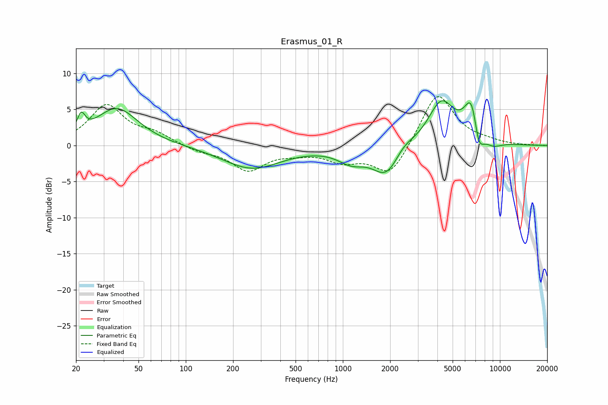

# Erasmus_01_R
See [usage instructions](https://github.com/jaakkopasanen/AutoEq#usage) for more options and info.

### Parametric EQs
Apply preamp of -6.3 dB when using parametric equalizer.

|   # | Type    |   Fc (Hz) |    Q |   Gain (dB) |
|-----|---------|-----------|------|-------------|
|   1 | Peaking |        22 | 5.79 |         2.4 |
|   2 | Peaking |        36 | 1.05 |         5.2 |
|   3 | Peaking |       263 | 0.76 |        -3.2 |
|   4 | Peaking |      1132 | 1.64 |        -1.8 |
|   5 | Peaking |      1908 | 1.59 |        -4.3 |
|   6 | Peaking |      2409 | 2.18 |         1.3 |
|   7 | Peaking |      4235 | 1.65 |         6   |
|   8 | Peaking |      6644 | 2.85 |         6.7 |
|   9 | Peaking |      7287 | 3.83 |        -4.5 |
|  10 | Peaking |      9009 | 2.28 |        -0.9 |

### Fixed Band EQs
When using fixed band (also called graphic) equalizer, apply preamp of **-6.9 dB** (if available) and set gains manually with these parameters.

|   # | Type    |   Fc (Hz) |    Q |   Gain (dB) |
|-----|---------|-----------|------|-------------|
|   1 | Peaking |        31 | 1.41 |         5.5 |
|   2 | Peaking |        62 | 1.41 |         1.4 |
|   3 | Peaking |       125 | 1.41 |        -0.8 |
|   4 | Peaking |       250 | 1.41 |        -3.3 |
|   5 | Peaking |       500 | 1.41 |        -0.7 |
|   6 | Peaking |      1000 | 1.41 |        -1.9 |
|   7 | Peaking |      2000 | 1.41 |        -4.4 |
|   8 | Peaking |      4000 | 1.41 |         7.5 |
|   9 | Peaking |      8000 | 1.41 |         0.4 |
|  10 | Peaking |     16000 | 1.41 |         0   |

### Graphs

