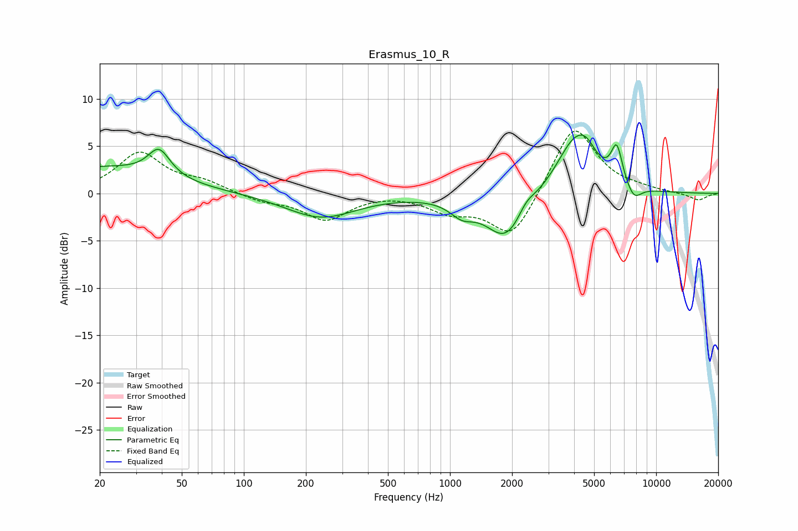

# Erasmus_10_R
See [usage instructions](https://github.com/jaakkopasanen/AutoEq#usage) for more options and info.

### Parametric EQs
Apply preamp of -6.3 dB when using parametric equalizer.

|   # | Type    |   Fc (Hz) |    Q |   Gain (dB) |
|-----|---------|-----------|------|-------------|
|   1 | Peaking |        20 | 0.46 |         2.7 |
|   2 | Peaking |        39 | 2.68 |         2.9 |
|   3 | Peaking |       236 | 0.83 |        -2.6 |
|   4 | Peaking |      1142 | 2.46 |        -1.4 |
|   5 | Peaking |      1878 | 1.43 |        -5   |
|   6 | Peaking |      2340 | 3.4  |         1.1 |
|   7 | Peaking |      4063 | 1.48 |         5.9 |
|   8 | Peaking |      4599 | 3.44 |         1.1 |
|   9 | Peaking |      6442 | 5    |         3.8 |
|  10 | Peaking |      7795 | 3.63 |        -1.6 |

### Fixed Band EQs
When using fixed band (also called graphic) equalizer, apply preamp of **-6.7 dB** (if available) and set gains manually with these parameters.

|   # | Type    |   Fc (Hz) |    Q |   Gain (dB) |
|-----|---------|-----------|------|-------------|
|   1 | Peaking |        31 | 1.41 |         4.2 |
|   2 | Peaking |        62 | 1.41 |         1.1 |
|   3 | Peaking |       125 | 1.41 |        -0.8 |
|   4 | Peaking |       250 | 1.41 |        -2.7 |
|   5 | Peaking |       500 | 1.41 |         0.1 |
|   6 | Peaking |      1000 | 1.41 |        -1.7 |
|   7 | Peaking |      2000 | 1.41 |        -4.9 |
|   8 | Peaking |      4000 | 1.41 |         7.5 |
|   9 | Peaking |      8000 | 1.41 |         0.3 |
|  10 | Peaking |     16000 | 1.41 |        -0.7 |

### Graphs

