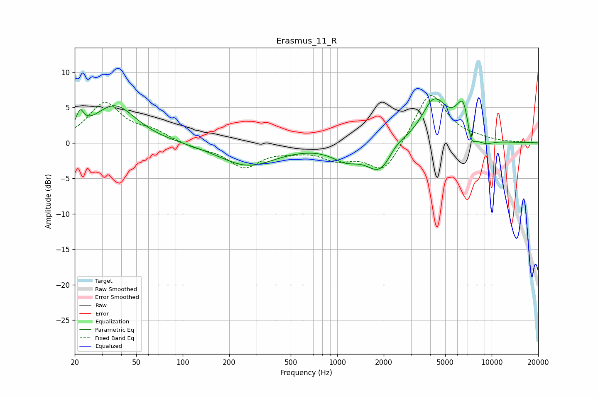

# Erasmus_11_R
See [usage instructions](https://github.com/jaakkopasanen/AutoEq#usage) for more options and info.

### Parametric EQs
Apply preamp of -6.3 dB when using parametric equalizer.

|   # | Type    |   Fc (Hz) |    Q |   Gain (dB) |
|-----|---------|-----------|------|-------------|
|   1 | Peaking |        22 | 5.95 |         2.3 |
|   2 | Peaking |        36 | 1.03 |         5.3 |
|   3 | Peaking |       263 | 0.77 |        -3.2 |
|   4 | Peaking |      1132 | 1.59 |        -1.8 |
|   5 | Peaking |      1912 | 1.6  |        -4.3 |
|   6 | Peaking |      2391 | 2.19 |         1.3 |
|   7 | Peaking |      4246 | 1.66 |         6.1 |
|   8 | Peaking |      6643 | 2.83 |         6.8 |
|   9 | Peaking |      7282 | 3.76 |        -4.5 |
|  10 | Peaking |      9019 | 2.26 |        -0.9 |

### Fixed Band EQs
When using fixed band (also called graphic) equalizer, apply preamp of **-6.8 dB** (if available) and set gains manually with these parameters.

|   # | Type    |   Fc (Hz) |    Q |   Gain (dB) |
|-----|---------|-----------|------|-------------|
|   1 | Peaking |        31 | 1.41 |         5.5 |
|   2 | Peaking |        62 | 1.41 |         1.4 |
|   3 | Peaking |       125 | 1.41 |        -0.6 |
|   4 | Peaking |       250 | 1.41 |        -3.3 |
|   5 | Peaking |       500 | 1.41 |        -0.7 |
|   6 | Peaking |      1000 | 1.41 |        -2   |
|   7 | Peaking |      2000 | 1.41 |        -4.4 |
|   8 | Peaking |      4000 | 1.41 |         7.4 |
|   9 | Peaking |      8000 | 1.41 |         0.3 |
|  10 | Peaking |     16000 | 1.41 |         0.1 |

### Graphs

