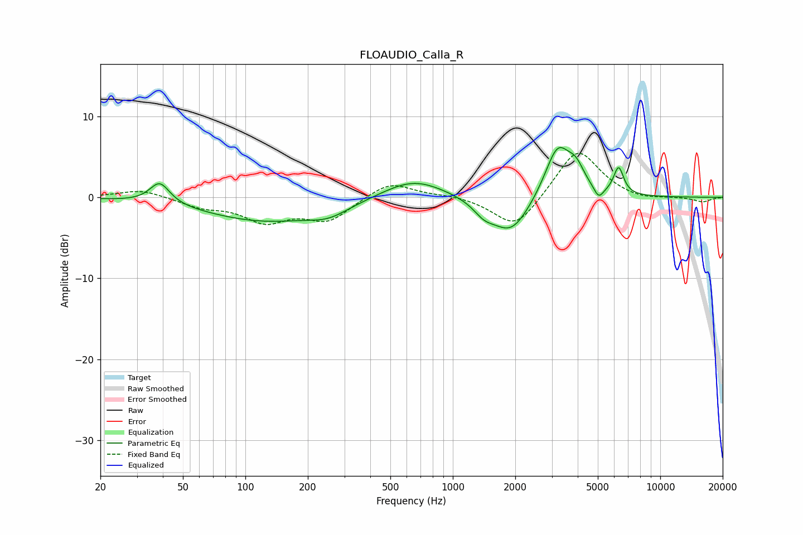

# FLOAUDIO_Calla_R
See [usage instructions](https://github.com/jaakkopasanen/AutoEq#usage) for more options and info.

### Parametric EQs
Apply preamp of -6.2 dB when using parametric equalizer.

|   # | Type    |   Fc (Hz) |    Q |   Gain (dB) |
|-----|---------|-----------|------|-------------|
|   1 | Peaking |        39 | 2.99 |         2.6 |
|   2 | Peaking |       125 | 0.48 |        -2.9 |
|   3 | Peaking |       252 | 1.5  |        -1.1 |
|   4 | Peaking |       646 | 0.93 |         2.5 |
|   5 | Peaking |      1415 | 2.86 |        -1.3 |
|   6 | Peaking |      1907 | 1.5  |        -4.7 |
|   7 | Peaking |      3202 | 2.22 |         6.5 |
|   8 | Peaking |      3928 | 3.45 |         2.2 |
|   9 | Peaking |      5048 | 6    |        -1.4 |
|  10 | Peaking |      6300 | 5.75 |         3.3 |

### Fixed Band EQs
When using fixed band (also called graphic) equalizer, apply preamp of **-5.5 dB** (if available) and set gains manually with these parameters.

|   # | Type    |   Fc (Hz) |    Q |   Gain (dB) |
|-----|---------|-----------|------|-------------|
|   1 | Peaking |        31 | 1.41 |         1   |
|   2 | Peaking |        62 | 1.41 |        -1.1 |
|   3 | Peaking |       125 | 1.41 |        -2.8 |
|   4 | Peaking |       250 | 1.41 |        -2.8 |
|   5 | Peaking |       500 | 1.41 |         2   |
|   6 | Peaking |      1000 | 1.41 |         0.3 |
|   7 | Peaking |      2000 | 1.41 |        -4.1 |
|   8 | Peaking |      4000 | 1.41 |         6.2 |
|   9 | Peaking |      8000 | 1.41 |        -0.5 |
|  10 | Peaking |     16000 | 1.41 |        -0.6 |

### Graphs

