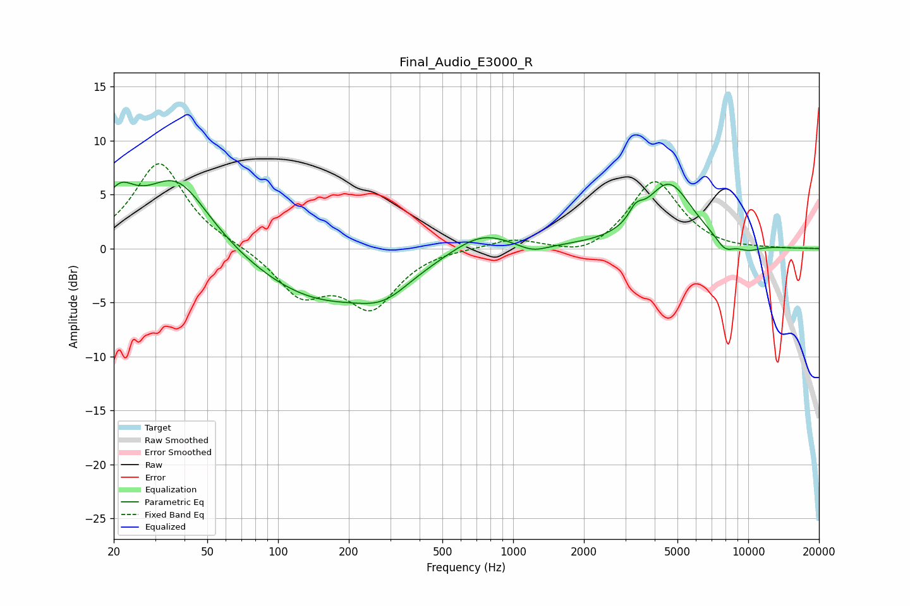

# Final_Audio_E3000_R
See [usage instructions](https://github.com/jaakkopasanen/AutoEq#usage) for more options and info.

### Parametric EQs
Apply preamp of -6.4 dB when using parametric equalizer.

|   # | Type    |   Fc (Hz) |    Q |   Gain (dB) |
|-----|---------|-----------|------|-------------|
|   1 | Peaking |        21 | 2.1  |         3.5 |
|   2 | Peaking |        37 | 0.99 |         6.8 |
|   3 | Peaking |       149 | 0.49 |        -4.7 |
|   4 | Peaking |       283 | 1.26 |        -2   |
|   5 | Peaking |       731 | 1.13 |         1.9 |
|   6 | Peaking |      1211 | 2.19 |        -0.7 |
|   7 | Peaking |      3327 | 4.84 |         1.2 |
|   8 | Peaking |      4600 | 1.39 |         5.9 |
|   9 | Peaking |      7954 | 3.31 |        -1.2 |
|  10 | Peaking |     10000 | 2.38 |        -0.6 |

### Fixed Band EQs
When using fixed band (also called graphic) equalizer, apply preamp of **-7.9 dB** (if available) and set gains manually with these parameters.

|   # | Type    |   Fc (Hz) |    Q |   Gain (dB) |
|-----|---------|-----------|------|-------------|
|   1 | Peaking |        31 | 1.41 |         8   |
|   2 | Peaking |        62 | 1.41 |         0.2 |
|   3 | Peaking |       125 | 1.41 |        -4.1 |
|   4 | Peaking |       250 | 1.41 |        -5.1 |
|   5 | Peaking |       500 | 1.41 |         0.1 |
|   6 | Peaking |      1000 | 1.41 |         0.9 |
|   7 | Peaking |      2000 | 1.41 |        -1   |
|   8 | Peaking |      4000 | 1.41 |         6.4 |
|   9 | Peaking |      8000 | 1.41 |        -0.2 |
|  10 | Peaking |     16000 | 1.41 |        -0   |

### Graphs

