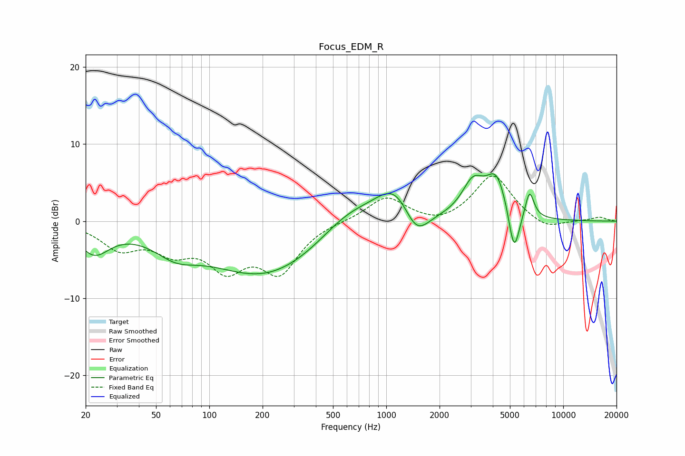

# Focus_EDM_R
See [usage instructions](https://github.com/jaakkopasanen/AutoEq#usage) for more options and info.

### Parametric EQs
Apply preamp of -6.2 dB when using parametric equalizer.

|   # | Type    |   Fc (Hz) |    Q |   Gain (dB) |
|-----|---------|-----------|------|-------------|
|   1 | Peaking |        22 | 1.6  |        -3.7 |
|   2 | Peaking |        64 | 1.16 |        -2.4 |
|   3 | Peaking |       208 | 0.42 |        -7.1 |
|   4 | Peaking |       604 | 0.88 |         2.9 |
|   5 | Peaking |      1139 | 1.22 |         5.3 |
|   6 | Peaking |      1469 | 1.85 |        -4.5 |
|   7 | Peaking |      3090 | 2.25 |         4.2 |
|   8 | Peaking |      4202 | 2.3  |         5.4 |
|   9 | Peaking |      5274 | 4.41 |        -6.2 |
|  10 | Peaking |      6448 | 5.41 |         3.6 |

### Fixed Band EQs
When using fixed band (also called graphic) equalizer, apply preamp of **-6.0 dB** (if available) and set gains manually with these parameters.

|   # | Type    |   Fc (Hz) |    Q |   Gain (dB) |
|-----|---------|-----------|------|-------------|
|   1 | Peaking |        31 | 1.41 |        -3.2 |
|   2 | Peaking |        62 | 1.41 |        -3.2 |
|   3 | Peaking |       125 | 1.41 |        -5.3 |
|   4 | Peaking |       250 | 1.41 |        -6.1 |
|   5 | Peaking |       500 | 1.41 |         0.1 |
|   6 | Peaking |      1000 | 1.41 |         3.2 |
|   7 | Peaking |      2000 | 1.41 |        -0.7 |
|   8 | Peaking |      4000 | 1.41 |         6.1 |
|   9 | Peaking |      8000 | 1.41 |        -1.2 |
|  10 | Peaking |     16000 | 1.41 |         0.5 |

### Graphs

