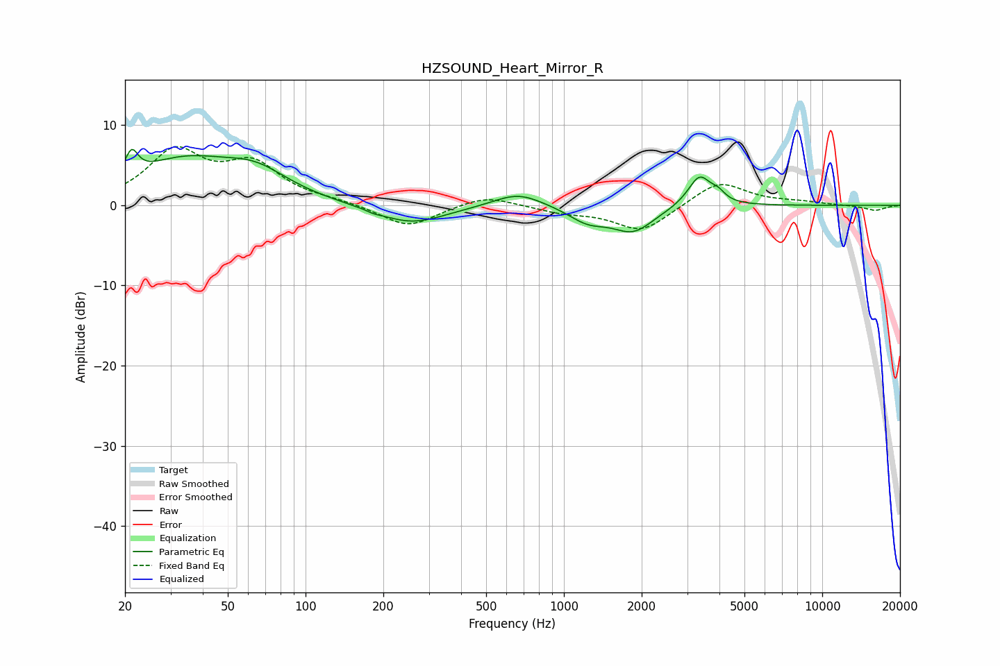

# HZSOUND_Heart_Mirror_R
See [usage instructions](https://github.com/jaakkopasanen/AutoEq#usage) for more options and info.

### Parametric EQs
Apply preamp of -7.1 dB when using parametric equalizer.

|   # | Type    |   Fc (Hz) |    Q |   Gain (dB) |
|-----|---------|-----------|------|-------------|
|   1 | Peaking |        21 | 5.82 |         3.1 |
|   2 | Peaking |        33 | 0.7  |         5.2 |
|   3 | Peaking |        65 | 1.12 |         2.9 |
|   4 | Peaking |       183 | 5.82 |        -0.2 |
|   5 | Peaking |       255 | 1.05 |        -2.4 |
|   6 | Peaking |       665 | 1.48 |         1.8 |
|   7 | Peaking |      1237 | 1.89 |        -1.8 |
|   8 | Peaking |      1855 | 1.75 |        -3.1 |
|   9 | Peaking |      3352 | 3.12 |         3.9 |
|  10 | Peaking |      3962 | 5.63 |         0.8 |

### Fixed Band EQs
When using fixed band (also called graphic) equalizer, apply preamp of **-7.4 dB** (if available) and set gains manually with these parameters.

|   # | Type    |   Fc (Hz) |    Q |   Gain (dB) |
|-----|---------|-----------|------|-------------|
|   1 | Peaking |        31 | 1.41 |         6.4 |
|   2 | Peaking |        62 | 1.41 |         4.7 |
|   3 | Peaking |       125 | 1.41 |         0.4 |
|   4 | Peaking |       250 | 1.41 |        -2.8 |
|   5 | Peaking |       500 | 1.41 |         1.4 |
|   6 | Peaking |      1000 | 1.41 |        -0.8 |
|   7 | Peaking |      2000 | 1.41 |        -3.3 |
|   8 | Peaking |      4000 | 1.41 |         3.1 |
|   9 | Peaking |      8000 | 1.41 |         0.4 |
|  10 | Peaking |     16000 | 1.41 |        -0.6 |

### Graphs

