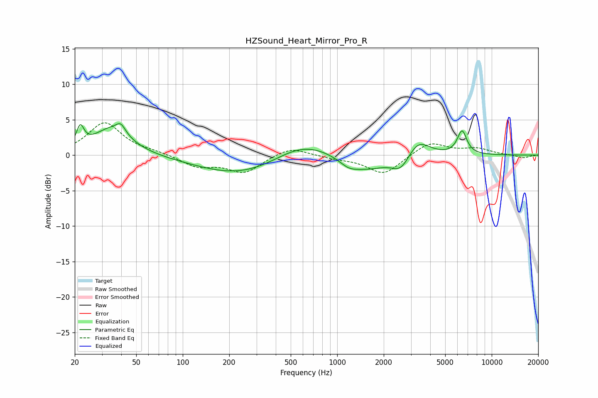

# HZSound_Heart_Mirror_Pro_R
See [usage instructions](https://github.com/jaakkopasanen/AutoEq#usage) for more options and info.

### Parametric EQs
Apply preamp of -4.5 dB when using parametric equalizer.

|   # | Type    |   Fc (Hz) |    Q |   Gain (dB) |
|-----|---------|-----------|------|-------------|
|   1 | Peaking |        22 | 5.95 |         2.7 |
|   2 | Peaking |        35 | 1.18 |         3.7 |
|   3 | Peaking |        40 | 4.8  |         1.3 |
|   4 | Peaking |       248 | 0.48 |        -3   |
|   5 | Peaking |       589 | 0.73 |         2.7 |
|   6 | Peaking |      1184 | 2.3  |        -1   |
|   7 | Peaking |      1559 | 1.02 |        -2   |
|   8 | Peaking |      2593 | 2.37 |        -2.2 |
|   9 | Peaking |      3317 | 1.87 |         2.6 |
|  10 | Peaking |      6426 | 4.49 |         3.3 |

### Fixed Band EQs
When using fixed band (also called graphic) equalizer, apply preamp of **-4.6 dB** (if available) and set gains manually with these parameters.

|   # | Type    |   Fc (Hz) |    Q |   Gain (dB) |
|-----|---------|-----------|------|-------------|
|   1 | Peaking |        31 | 1.41 |         4.6 |
|   2 | Peaking |        62 | 1.41 |         0.4 |
|   3 | Peaking |       125 | 1.41 |        -1.6 |
|   4 | Peaking |       250 | 1.41 |        -2.4 |
|   5 | Peaking |       500 | 1.41 |         1.3 |
|   6 | Peaking |      1000 | 1.41 |        -0.4 |
|   7 | Peaking |      2000 | 1.41 |        -2.7 |
|   8 | Peaking |      4000 | 1.41 |         1.9 |
|   9 | Peaking |      8000 | 1.41 |         0.9 |
|  10 | Peaking |     16000 | 1.41 |        -0.4 |

### Graphs

