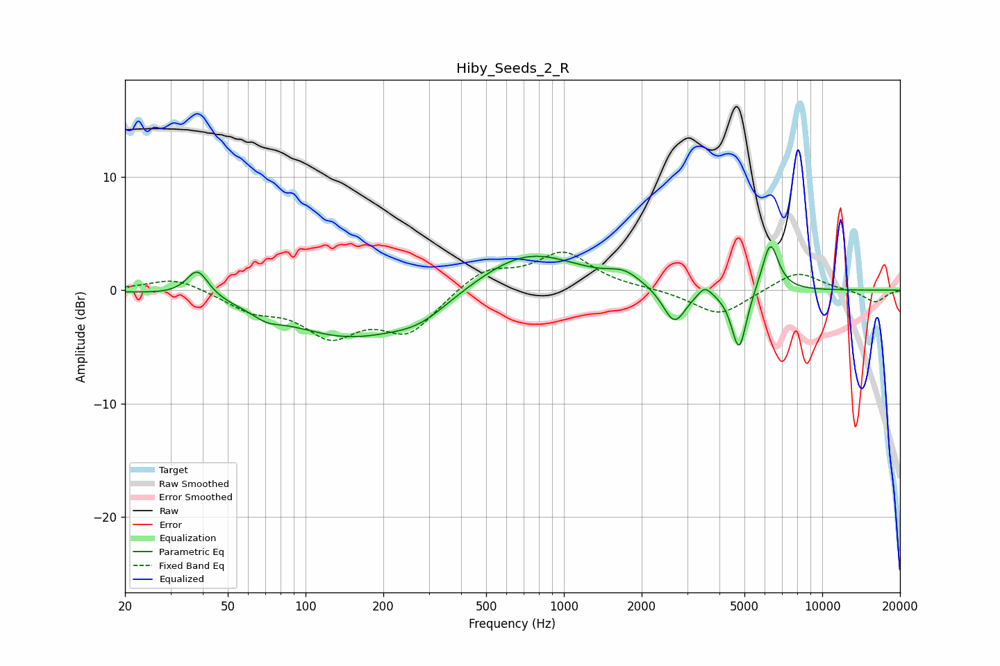

# Hiby_Seeds_2_R
See [usage instructions](https://github.com/jaakkopasanen/AutoEq#usage) for more options and info.

### Parametric EQs
Apply preamp of -3.9 dB when using parametric equalizer.

|   # | Type    |   Fc (Hz) |    Q |   Gain (dB) |
|-----|---------|-----------|------|-------------|
|   1 | Peaking |        38 | 3.4  |         2.5 |
|   2 | Peaking |        71 | 2.54 |        -0.7 |
|   3 | Peaking |       146 | 0.56 |        -4   |
|   4 | Peaking |       278 | 1.25 |        -1.4 |
|   5 | Peaking |       722 | 0.72 |         3.6 |
|   6 | Peaking |      1710 | 2.29 |         1   |
|   7 | Peaking |      2676 | 3.18 |        -3.2 |
|   8 | Peaking |      3512 | 5.59 |         0.9 |
|   9 | Peaking |      4765 | 4.74 |        -5.5 |
|  10 | Peaking |      6293 | 4.25 |         4.4 |

### Fixed Band EQs
When using fixed band (also called graphic) equalizer, apply preamp of **-3.5 dB** (if available) and set gains manually with these parameters.

|   # | Type    |   Fc (Hz) |    Q |   Gain (dB) |
|-----|---------|-----------|------|-------------|
|   1 | Peaking |        31 | 1.41 |         1.2 |
|   2 | Peaking |        62 | 1.41 |        -1.6 |
|   3 | Peaking |       125 | 1.41 |        -3.6 |
|   4 | Peaking |       250 | 1.41 |        -3.5 |
|   5 | Peaking |       500 | 1.41 |         1.9 |
|   6 | Peaking |      1000 | 1.41 |         3.2 |
|   7 | Peaking |      2000 | 1.41 |         0.1 |
|   8 | Peaking |      4000 | 1.41 |        -2.3 |
|   9 | Peaking |      8000 | 1.41 |         1.7 |
|  10 | Peaking |     16000 | 1.41 |        -1.1 |

### Graphs

