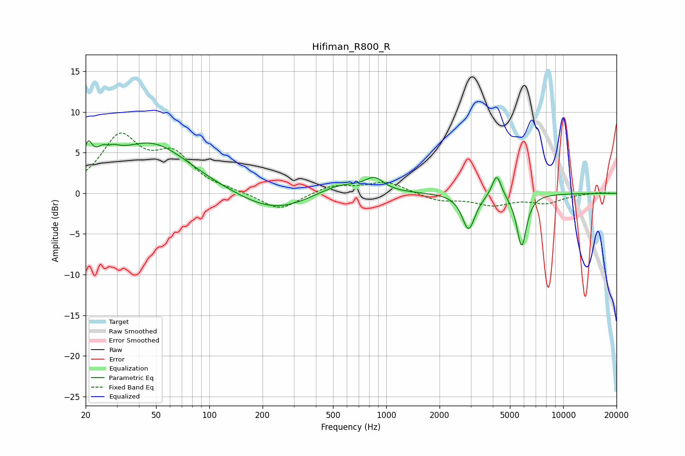

# Hifiman_R800_R
See [usage instructions](https://github.com/jaakkopasanen/AutoEq#usage) for more options and info.

### Parametric EQs
Apply preamp of -6.6 dB when using parametric equalizer.

|   # | Type    |   Fc (Hz) |    Q |   Gain (dB) |
|-----|---------|-----------|------|-------------|
|   1 | Peaking |        21 | 6    |         3   |
|   2 | Peaking |        26 | 2.84 |         2.8 |
|   3 | Peaking |        27 | 5.92 |        -0.9 |
|   4 | Peaking |        47 | 0.64 |         6.1 |
|   5 | Peaking |       232 | 0.69 |        -2.5 |
|   6 | Peaking |       547 | 1.02 |         1.5 |
|   7 | Peaking |       858 | 2.78 |         1.5 |
|   8 | Peaking |      2919 | 3.91 |        -4.4 |
|   9 | Peaking |      4208 | 5.42 |         2.9 |
|  10 | Peaking |      5820 | 5.01 |        -6.5 |

### Fixed Band EQs
When using fixed band (also called graphic) equalizer, apply preamp of **-7.5 dB** (if available) and set gains manually with these parameters.

|   # | Type    |   Fc (Hz) |    Q |   Gain (dB) |
|-----|---------|-----------|------|-------------|
|   1 | Peaking |        31 | 1.41 |         6.6 |
|   2 | Peaking |        62 | 1.41 |         4.2 |
|   3 | Peaking |       125 | 1.41 |         0.2 |
|   4 | Peaking |       250 | 1.41 |        -2.2 |
|   5 | Peaking |       500 | 1.41 |         1   |
|   6 | Peaking |      1000 | 1.41 |         1.4 |
|   7 | Peaking |      2000 | 1.41 |        -0.9 |
|   8 | Peaking |      4000 | 1.41 |        -1.3 |
|   9 | Peaking |      8000 | 1.41 |        -1.1 |
|  10 | Peaking |     16000 | 1.41 |         0.1 |

### Graphs

