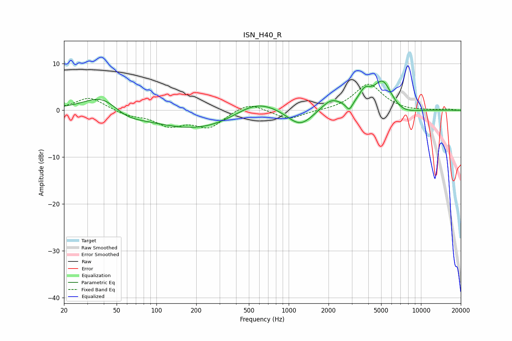

# ISN_H40_R
See [usage instructions](https://github.com/jaakkopasanen/AutoEq#usage) for more options and info.

### Parametric EQs
Apply preamp of -6.3 dB when using parametric equalizer.

|   # | Type    |   Fc (Hz) |    Q |   Gain (dB) |
|-----|---------|-----------|------|-------------|
|   1 | Peaking |        41 | 0.98 |         4.8 |
|   2 | Peaking |        55 | 1    |        -2.7 |
|   3 | Peaking |       215 | 0.41 |        -4.3 |
|   4 | Peaking |       568 | 0.82 |         3.6 |
|   5 | Peaking |      1220 | 1.45 |        -3.7 |
|   6 | Peaking |      2093 | 1.87 |         2.5 |
|   7 | Peaking |      2872 | 5.98 |        -1.8 |
|   8 | Peaking |      3753 | 3.14 |         2.9 |
|   9 | Peaking |      5140 | 1.97 |         6.2 |
|  10 | Peaking |      7236 | 1.38 |        -1.3 |

### Fixed Band EQs
When using fixed band (also called graphic) equalizer, apply preamp of **-5.6 dB** (if available) and set gains manually with these parameters.

|   # | Type    |   Fc (Hz) |    Q |   Gain (dB) |
|-----|---------|-----------|------|-------------|
|   1 | Peaking |        31 | 1.41 |         2.8 |
|   2 | Peaking |        62 | 1.41 |        -1   |
|   3 | Peaking |       125 | 1.41 |        -3   |
|   4 | Peaking |       250 | 1.41 |        -3.5 |
|   5 | Peaking |       500 | 1.41 |         1.9 |
|   6 | Peaking |      1000 | 1.41 |        -2   |
|   7 | Peaking |      2000 | 1.41 |        -0.1 |
|   8 | Peaking |      4000 | 1.41 |         5.6 |
|   9 | Peaking |      8000 | 1.41 |        -0.2 |
|  10 | Peaking |     16000 | 1.41 |         0.2 |

### Graphs

